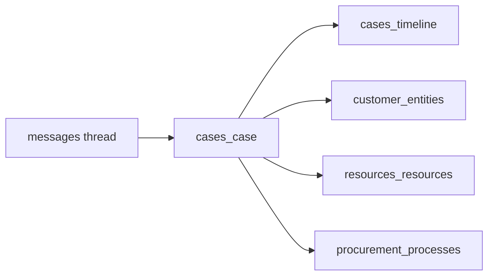

# CRM concierge — cases (omnichannel service threads)

## TLDR

Wprowadzić moduł lub podobszar **`cases`** (nazwa modułu: `cases` lub `service_cases`) z encją **sprawy** łączącą klienta, opcjonalnie **zasób** (`resources_resources.id`), **proces** (`procurement_processes.id`), oraz **timeline** zdarzeń z kanałów (email, telefon, notatka). Integracja z [`messages`](packages/core/src/modules/messages/) i [`inbox_ops`](packages/core/src/modules/inbox_ops/) przez **UUID case_id** na istniejących lub nowych rekordach wiadomości (additive metadata / kolumna — do potwierdzenia w implementacji bez łamania BC).

## Overview

Plan CRM wymaga jednego wątku obsługi zamiast rozproszonej skrzynki i WhatsApp. Minimalny MVP: **sprawa + powiązania + widok backend** + możliwość podpięcia wiadomości; pełna synchronizacja mail jako faza kolejna.

## Problem Statement

1. Wiadomości i wątki inbox nie mają dziś kanonicznego „case” ID wspólnego dla telefonu i email.
2. Opiekun musi widzieć historię przy kliencie i przy pojeździe.

## Proposed Solution

### Encje (preferowany moduł `cases`)

1. **`Case`**
   - `id`, `tenant_id`, `organization_id`, `title`, `status_value` (+ label/color opcjonalnie jak w innych encjach), `customer_entity_id` (uuid), `resource_id` (uuid nullable), `procurement_process_id` (uuid nullable), `owner_user_id` (opiekun), `opened_at`, `closed_at` nullable, `priority`, `metadata`, soft delete.

2. **`CaseTimelineEvent`**
   - `case_id`, `event_type` (enum tekstowy: `note`, `email`, `phone`, `status_change`, `system`), `message` / `body`, `occurred_at`, `actor_user_id`, `source_ref` (jsonb: np. `{ "messageId": "...", "channel": "email" }`).

### Integracja messages / inbox_ops

- **Additive:** dodać `case_id uuid null` na encji wątku/wiadomości w module `messages` lub powiązanie przez `metadata` — wybór w implementacji; preferencja **kolumna** dla indeksów listy „sprawa → wiadomości”.
- Inbox ops: jeśli ma encję „thread”, dodać `case_id` tam samo.
- Nie usuwać istniejących pól; tylko rozszerzenie ([`BACKWARD_COMPATIBILITY.md`](../../BACKWARD_COMPATIBILITY.md)).

### Telefon

- Logowanie połączenia jako `CaseTimelineEvent` z `event_type=phone` + ręczny opis lub integracja CTI (poza MVP).

### UI backend

- `/backend/cases` — lista (DataTable, filtry: status, opiekun, klient).
- `/backend/cases/[id]` — layout 7/3: metadane + zakładki Timeline | Powiązane (resource, process) | Wiadomości (widget inject lub embedded lista z filtrem `case_id`).

### API

- CRUD cases + `POST /api/cases/:id/timeline` dla notatek.
- `GET /api/cases/:id/messages` — agregacja przez query do messages po `case_id`.

## Architecture

## RBAC

- `cases.view`, `cases.create`, `cases.edit`, `cases.close`, `cases.delete`.

## Events

- `cases.case.created`, `cases.case.closed`, `cases.timeline.appended` (dla SSE / notyfikacji opcjonalnie).

## Integration tests

- Utworzenie sprawy z `customer_entity_id` + podpięcie `resource_id`.
- Utworzenie wiadomości/wątku z `case_id` i odczyt listy.
- Zamknięcie sprawy: `closed_at` + status.

## Risks and Impact Review

| Ryzyko | Ważność | Mitygacja |
|--------|---------|-----------|
| Migracja messages — lock na dużych tabelach | Średnia | `case_id` nullable, indeks concurrent, backfill skryptem |
| Duplikacja timeline vs procurement timeline | Średnia | Jasny podział: procurement = proces zakupowy; case = obsługa klienta omnichannel |

## Final Compliance Report

- Cross-module tylko UUID.
- Zgodność z `.cursor/rules/backend-views-conventions.mdc` dla list i detail.

## Phasing

1. Moduł `cases` + CRUD + timeline.
2. Kolumna `case_id` w messages (lub równoważna) + API filtrowania.
3. Backend UI lista + detail.
4. Mail ingestion: osobna spec lub rozszerzenie fazy 2.

## Changelog

| Data | Opis |
|------|------|
| 2026-05-02 | Utworzenie specyfikacji. |
| 2026-05-02 | Zakładka „Playbooks” na `/backend/cases/cases/[id]` (tagi z `metadata.contextTags`). |
