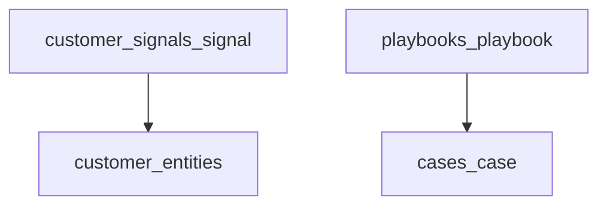

# CRM concierge — customer behavioral signals and playbooks

## TLDR

Dodać moduł **`customer_signals`** (lub prefiks `crm_signals`) z **append-only** zdarzeniami zachowania (`customer_entity_id`, typ, payload, źródło, czas) oraz moduł / podsystem **`playbooks`** z wersjonowanymi procedurami (np. szkoda, kolizja). Agregacja sygnałów na karcie klienta (widget injekcja); **integracja** z [`customers` activities](packages/core/src/modules/customers/) tam, gdzie aktywność = ręczny kontakt — unikać podwójnego zapisu tej samej semantyki (jedno źródło: sygnał vs activity — reguły mapowania w implementacji).

## Overview

Plan CRM wymaga historii „czego szukał, co sprawdzał” oraz wytycznych postępowania dla klienta. Platforma ma już `activities`, event bus, `audit_logs` — sygnały produktowe powinny być **queryowalne** i **typowane**, nie tylko logiem audytu.

## Problem Statement

1. `activities` są zaprojektowane pod interakcje CRM (połączenie, spotkanie), nie pod fine-grained product analytics.
2. Procedury szkody/kolizji nie mają encji z kontekstem i powiązaniem ze sprawą.

## Proposed Solution

### A) Customer signals

**Encja `CustomerSignal`**

- `id`, `tenant_id`, `organization_id`, `customer_entity_id` (uuid), `signal_type` (text lub słownik: `catalog.view`, `portal.search`, `resource.photo.opened`, …), `source` (`backend`, `portal`, `integration`, `manual`), `subject_entity_type` nullable (text), `subject_entity_id` uuid nullable (np. zasób), `payload jsonb`, `occurred_at`, `created_at`.
- Indeksy: `(customer_entity_id, occurred_at desc)`, `(signal_type, occurred_at)`.
- API: `POST /api/customer-signals` (batch opcjonalnie dla integracji) + `GET` lista filtrowana po kliencie (paginacja).
- **RBAC:** `customer_signals.ingest` (service), `customer_signals.view` (użytkownik z dostępem do klienta — sprawdzać też `customers.view`).

**Integracja z istniejącym modelem**

- Subskrybenci eventów domenowych mogą emitować sygnał (np. po `catalog.product.viewed` jeśli taki event istnieje) — tylko gdy nie duplikuje dedykowanego logu.
- Na stronie detail klienta: widget injection `crud-form:customers.person:fields` lub osobna zakładka „Sygnały” (`data-table:customer-signals`).

### B) Playbooks

**Encja `Playbook`**

- `id`, `tenant_id`, `organization_id`, `slug` (unique per org), `title`, `body` (markdown lub rich JSON), `context_tags` (text[] lub jsonb: `damage`, `collision`, `theft`), `audience` (`internal` | `customer_facing` | `both`), `version`, `published_at`, `is_active`, soft delete.

**Opcjonalnie `PlaybookBinding`**

- `playbook_id`, `case_id` nullable, `resource_type_slug` nullable — które playbooky sugerować w UI.

**UI**

- Backend: CRUD playbooków (jak artykuły / dictionary-heavy form).
- Powiązanie ze [`cases`](2026-05-02-crm-cases-omnichannel.md): panel „Zalecane procedury” na podstawie `context_tags` sprawy.

**Alternatywa:** treść w [`content`](packages/core/src/modules/content/) + metadane — odrzucona jako MVP jeśli brak wersjonowania; playbook jako encja daje **version** i audyt.

## Architecture

## API Contracts

- CRUD playbooks + list publicznych (tylko `customer_facing` + `is_active`) pod osobnym feature gate dla przyszłego API klienta (poza bieżącym scope planu — przygotować endpoint jako `optional` / feature flag).

## Integration tests

- Zapis sygnału + lista po `customer_entity_id`.
- Playbook publish + odczyt na case z tagiem `collision`.
- Brak duplikatu: jedna akcja użytkownika nie powinna tworzyć `Activity` i `CustomerSignal` z tym samym znaczeniem — test regresji po ustaleniu mapy.

## Risks and Impact Review

| Ryzyko | Ważność | Mitygacja |
|--------|---------|-----------|
| Explozja wolumenu sygnałów | Średnia | TTL archiwizacji / partycjonowanie (future); rate limit na ingest |
| PII w payload | Wysoka | Zod schema whitelist; szyfrowanie zgodnie z [`packages/core/AGENTS.md`](../../packages/core/AGENTS.md) jeśli wrażliwe pola |

## Final Compliance Report

- Nowe ACL i event IDs zgodnie z konwencją.
- Brak cross-module ORM.

## Phasing

1. `CustomerSignal` + API ingest/view + widget na karcie klienta.
2. `Playbook` + CRUD + powiązanie z cases (read-only panel).
3. Subskrybenci eventów (wybrane typy) — iteracyjnie.

## Changelog

| Data | Opis |
|------|------|
| 2026-05-02 | Utworzenie specyfikacji. |
| 2026-05-02 | Moduł `playbooks` (rejestracja, ACL, `GET /api/playbooks/match`); panel procedur na detail sprawy. |
| 2026-05-02 | CRUD playbooków (`/api/playbooks`), backend lista/create/detail; widget sygnałów na profilu osoby/firmy; RBAC listy sygnałów + dostęp CRM; test TC-INT-008. |
