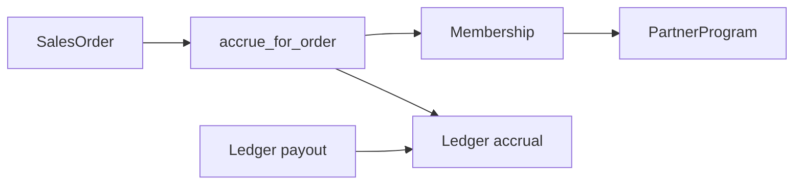

# CRM concierge — partner program module

## TLDR

Moduł core **`partner_programs`**: program partnerski + członkostwa wyłącznie dla `CustomerEntity` z `crm_record_type = 'partner'`. Faza incentive: procent od zamówienia, ledger accrual/payout, zakładka na profilu partnera.

## Overview

W `customers` istnieje segment **`partner`**. Moduł opisuje program B2B, membershipy oraz rozliczenia incentive z leadów/zamówień (referring partner na `SalesOrder`).

## Problem Statement

1. `referral_code` nie wystarcza do opisu programu (warunki, zakres, daty, %).
2. Powiązanie z nie-partnerem musi być **niemożliwe** na poziomie systemu.
3. Brak ledgeru i wypłat za zamówienia przypisane do partnera.

## Proposed Solution

### Encje

1. **`PartnerProgram`**
   - `id`, `tenant_id`, `organization_id`, `name`, `description`, `valid_from`, `valid_to`, `is_active`
   - **`incentive_percent`** `numeric(7,4)` (0–100) — % od zamówienia
   - **`incentive_base`**: `net` | `gross` — od `grandTotalNetAmount` / `grandTotalGrossAmount`
   - `metadata jsonb`, timestamps, `deleted_at`

2. **`PartnerProgramMembership`**
   - `program_id`, `customer_entity_id` (uuid, bez ORM do customers)
   - `role`, `joined_at`, `left_at`
   - Unique: `(program_id, customer_entity_id)` where `deleted_at is null`

3. **`PartnerIncentiveLedgerEntry`** → `partner_programs_incentive_ledger`
   - `customer_entity_id`, `program_id` (nullable; wymagane przy accrual)
   - `kind`: `accrual` | `payout`
   - `amount` signed, `currency_code`
   - `sales_order_id` (nullable; wymagane przy accrual)
   - `rate_percent`, `base_amount` (snapshot accrual)
   - `note`, `created_by_user_id`
   - Unique partial: `(sales_order_id) WHERE kind = 'accrual' AND deleted_at IS NULL`

### Naliczanie

- Trigger: `sales.order.created` / `sales.order.updated` / `sales.document.totals.calculated` gdy `referringPartnerEntityId` ustawione (fail-soft; idempotentne).
- Ops/re-sync: `POST /api/partner_programs/incentives/accrue` (`orderId`).
- Wybór programu: **`referringPartnerProgramId` na zamówieniu** (UI: picker gdy partner ma >1 membership; przy 1 — auto). Accrual używa tego programu; bez wyboru — fallback highest `%`.
- Amount = `grandTotalNetAmount * incentivePercent / 100`.
- Idempotentnie 1 accrual / order.
- Brak membershipu → skip (bez błędu create order).

### Payout

- `POST` payout: amount = −currentPayable dla waluty; blokada gdy payable ≤ 0.

### Walidacja partnera

- Membership: `crmRecordType === 'partner'` → kod `PARTNER_PROGRAM_MEMBERSHIP_INVALID_CUSTOMER_TYPE`.

### API

- CRUD programów (+ `incentivePercent`).
- Membership nested + `GET /api/partner_programs/memberships?customerEntityId=`.
- `GET /api/partner_programs/incentives?customerEntityId=`
- `GET /api/partner_programs/incentives/balance?customerEntityId=`
- `POST /api/partner_programs/incentives/payout`
- `POST /api/partner_programs/incentives/accrue`

### UI

- Program: pole %, zakładka Partners (people + companies, `crmRecordTypes=partner`).
- Profil partnera (people-v2 / companies-v2): injected tab — memberships, ledger, saldo, wypłata.

## Architecture

## RBAC

- Istniejące: `view`, `create`, `edit`, `delete`, `manage_memberships`, `settings.manage`
- Nowe: **`partner_programs.manage_payouts`**
- Employee: `view`, `manage_memberships`, `manage_payouts`

## Events

- program / membership CRUD (istniejące)
- `partner_programs.incentive.accrued`
- `partner_programs.incentive.payout_created`

## Integration tests

- Non-partner membership → 400.
- Partner membership OK; duplicate → 409.
- Order z referring partner + program % → accrual.
- Payout zeruje payable.

## Risks and Impact Review

| Ryzyko | Ważność | Mitygacja |
|--------|---------|-----------|
| Podwójne accrual | Średnia | Unique partial na `sales_order_id` |
| Subscriber psuje create order | Wysoka | Fail-soft / log |
| Wiele walut | Niska | Balance per currency; payout per currency |

## Final Compliance Report

- Brak cross-module ORM.
- Nowe ACL feature IDs — nie zmieniać po publikacji.

## Phasing

1. Program + membership (done).
2. Incentive % + ledger + payout + subscriber + partner tab (this change).
3. Future: discount tiers / routing.

## Changelog

| Data | Opis |
|------|------|
| 2026-05-02 | Utworzenie specyfikacji + MVP program/membership. |
| 2026-07-25 | Faza incentive: `incentivePercent`, ledger accrual/payout, API balance/payout, subscriber `sales.order.created`, UI % + people/companies picker, zakładka partnera. |
