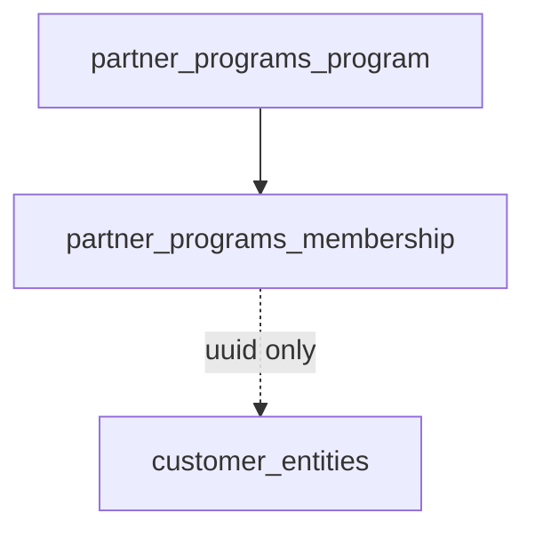

# CRM concierge — partner program module

## TLDR

Dodać nowy moduł core (nazwa robocza **`partner_programs`**) z encją **programu partnerskiego** i powiązaniami **wyłącznie** do [`CustomerEntity`](packages/core/src/modules/customers/data/entities.ts) z `crm_record_type = 'partner'`. Walidacja na poziomie command/API. Faza 2 (poza MVP modułu): rabaty, routing usług, KPI — odwołanie do planu CRM bez implementacji w pierwszej fazie.

## Overview

W `customers` istnieje segment **`partner`** (`crmRecordType`). Brakuje struktury „program lojalnościowy / B2B agreement” z wieloma partnerami, okresem obowiązywania i regułami. Moduł izoluje domenę programów od `procurement` (dostawcy procesu) i od surowej listy firm.

## Problem Statement

1. `referral_code` na encji klienta nie wystarcza do opisu programu (warunki, zakres, daty).
2. Powiązanie z nie-partnerem musi być **niemożliwe** na poziomie systemu, nie tylko UI.

## Proposed Solution

### Encje (module `partner_programs`)

1. **`PartnerProgram`**
   - `id`, `tenant_id`, `organization_id`, `name`, `description`, `valid_from`, `valid_to`, `is_active`, `metadata jsonb`, timestamps, `deleted_at`.

2. **`PartnerProgramMembership`**
   - `program_id` (FK w module), `customer_entity_id` (**uuid**, bez ORM do customers).
   - `role` (text nullable — np. `preferred_bodyshop`), `joined_at`, `left_at` nullable.
   - Unique: `(program_id, customer_entity_id)` where `deleted_at is null`.

### Walidacja partnera

- Przy `create`/`update` membership: załaduj `CustomerEntity` przez EM w obrębie tego samego żądania (lub serwis DI `customers`) i sprawdź `crmRecordType === 'partner'` oraz `organizationId` / `tenantId` zgodność.
- Jeśli nie-partner: odrzuć z kodem **`PARTNER_PROGRAM_MEMBERSHIP_INVALID_CUSTOMER_TYPE`**.

### API

- CRUD programów: `makeCrudRoute` + indexer entity type `partner_programs.program`.
- CRUD membership jako zagnieżdżony resource lub osobny route z `programId` w ścieżce.
- OpenAPI: pełne schematy.

### UI backend

- Lista programów (DataTable), detail z zakładką „Partnerzy” (wyszukiwarka encji z filtrem **tylko partner** — reuse entity search combobox z guardem typu).

### Relacja do planu CRM (faza 2)

- Tabele `partner_program_discount_tiers`, `partner_program_routing_rules` — **poza zakresem** pierwszej implementacji; zarezerwować `metadata` na MVP.

## Architecture

## RBAC

- `partner_programs.view`, `partner_programs.create`, `partner_programs.edit`, `partner_programs.delete`, `partner_programs.manage_memberships`.
- `setup.ts`: przypisanie do ról admin/employee zgodnie z polityką tenant.

## Events

- `partner_programs.program.created|updated|deleted`
- `partner_programs.membership.created|deleted`

(subskrybenci: indeksowanie, opcjonalne powiadomienia).

## Integration tests

- Utworzenie programu + dodanie `customer` (non-partner) → błąd.
- Utworzenie `company` z `crmRecordType=partner` + membership → sukces.
- Unikalność podwójnego membership.

## Risks and Impact Review

| Ryzyko | Ważność | Mitygacja |
|--------|---------|-----------|
| Obchodzenie API surowym SQL | Niska | Walidacja w command; test integracyjny |
| Nazwa modułu vs istniejący SPEC PRM | Średnia | Nazwa `partner_programs` odróżnia od enterprise PRM w `.ai/specs/enterprise/` jeśli kolizja marketingowa — dokumentacja w `index.ts` |

## Final Compliance Report

- Brak cross-module ORM.
- Nowe ACL feature IDs — **nie zmieniać** po publikacji ([`BACKWARD_COMPATIBILITY.md`](../../BACKWARD_COMPATIBILITY.md)).

## Phasing

1. Moduł scaffold + encje + migracja + CRUD program + ACL + setup.
2. Membership CRUD + walidacja typu partner.
3. Backend UI lista + detail + i18n.
4. Faza 2: rabaty i routing (osobny rozdział spec lub rozszerzenie).

## Changelog

| Data | Opis |
|------|------|
| 2026-05-02 | Utworzenie specyfikacji. |
| 2026-05-02 | Implementacja modułu `partner_programs`: encje, migracja (w tym unikalny indeks częściowy na członkostwach), CRUD API + membership, ACL/setup/events, UI backend (lista, create, detail z zakładką partnerów), testy integracyjne TC-CRM-028. |
