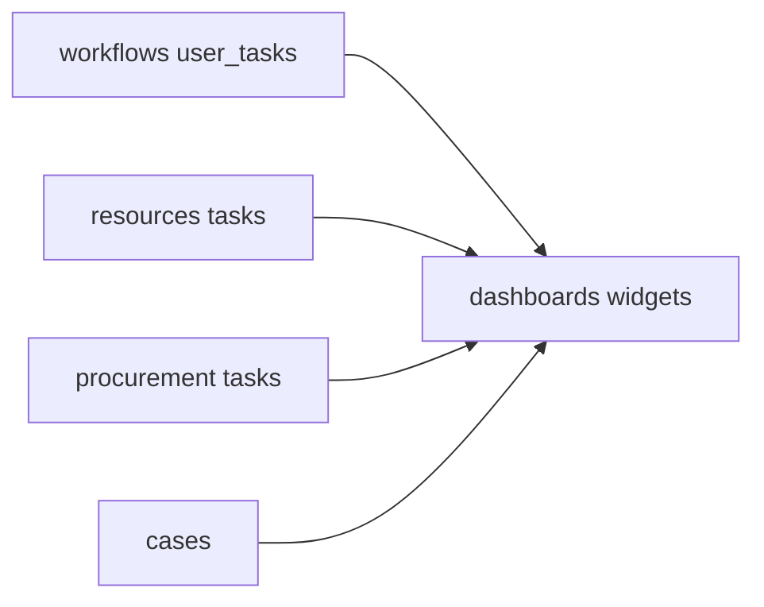

# CRM concierge — QC patterns, operational oversight, dashboards

## TLDR

Zrealizować **kontrolę jakości** (np. dwie role: wykonanie + weryfikacja) przez istniejące [`workflows`](packages/core/src/modules/workflows/) (`USER_TASK`, ewentualnie parallel fork) i/lub **typ zadania** w [`procurement`](packages/core/src/modules/procurement/) / [`resources` resource tasks](2026-05-02-crm-resource-tasks-scheduler.md) z wymaganym drugim podpisem; **nadzór operacyjny** przez rozszerzenie [`dashboards`](packages/core/src/modules/dashboards/) o widżety KPI (przeterminowane zadania na zasobie, otwarte QC, sprawy bez odpowiedzi); integracje mail/WhatsApp **po** stabilnym module [`cases`](2026-05-02-crm-cases-omnichannel.md) — nie blokują MVP.

## Overview

Plan CRM (pkt 6–8) wymaga: QC dwuetapowego, procedur/playbooków (por. [sygnały i playbooki](2026-05-02-crm-customer-signals-and-playbooks.md)), oraz widoczności operacyjnej. Ten dokument spiętrza **wzorce implementacji** bez wprowadzania osobnego silnika QC.

## Problem Statement

1. „Jeden foliuje, drugi sprawdza” musi być **audytowalne** i nie ginąć w czacie.
2. Manager potrzebuje jednego ekranu z przeterminowanymi SLA.

## Proposed Solution

### QC (quality control)

**Wzorzec 1 — Workflows**

- Definicja workflow z krokami: `USER_TASK` „Aplikacja” → `USER_TASK` „Kontrola jakości” z warunkiem przejścia tylko gdy pole `qcApproved` w kontekście.
- Powiązanie z procesem: już wspierane przez `work_item_user_task_id` na `ProcurementProcessTask`.

**Wzorzec 2 — Zadania z polem QC**

- Rozszerzyć encję zadania (procurement lub resource) o: `qc_required boolean`, `qc_completed_at`, `qc_completed_by_user_id`, `qc_parent_task_id` (self-FK w tym samym module) — **tylko jeśli** workflow jest zbyt ciężki dla codziennej obsługi; decyzja w implementacji po UX review.

**Rekomendacja spec:** preferuj **Workflow** dla ścieżek wieloetapowych; **pole QC na zadaniu** dla lekkich checklistów jednego dostawcy.

### Nadzór operacyjny

- **Dashboard widgets** (rejestracja w module `dashboards`):
  - `crm.overdue_resource_tasks` — liczba + link do filtra listy zadań.
  - `crm.open_cases_sla` — sprawy w statusie otwarty z `opened_at` starszym niż próg.
  - `crm.qc_pending` — user tasks workflow w kroku QC lub zadania z `qc_required` bez `qc_completed_at`.

- Źródła danych: read-only zapytania scoped `organization_id`; cache opcjonalny z [`packages/cache/AGENTS.md`](../../packages/cache/AGENTS.md).

### Integracje (mail / WhatsApp)

- Po `cases.case_id` na wątku wiadomości: widżet „Skrzynka” na detail case.
- WhatsApp: pakiet integracyjny poza core (zgodnie z root `AGENTS.md`) — osobna spec integracji.

## Architecture

## RBAC

- Widżety respektują feature `dashboards.view` + granularne `cases.view`, `resources.view`, `procurement.view` — agregacja zwraca **counts bez szczegółów** jeśli brak uprawnień do podmodułu (fail-closed lub maskowanie — ustalić w implementacji; preferencja **ukryj widżet** jeśli brak feature).

## Integration tests

- Seed: zadanie przeterminowane → widżet zwraca count ≥ 1.
- Workflow: krok QC nie przechodzi bez approve.
- Dashboard render bez N+1 (batch query test).

## Risks and Impact Review

| Ryzyko | Ważność | Mitygacja |
|--------|---------|-----------|
| Zbyt wiele widżetów obciąża home | Średnia | Limit czasu zapytania, indeksy po `due_at`, `opened_at` |
| Rozjazd definicji QC między modułami | Średnia | Dokumentacja „kiedy workflow vs pole QC” w `AGENTS.md` modułu concierge / resources |

## Final Compliance Report

- Brak nowych globalnych silników poza konfiguracją workflow i widżetów.
- Zgodność z [`packages/core/src/modules/dashboards/`](../../packages/core/src/modules/dashboards/) konwencją rejestracji widgetów.

## Phasing

1. Widżety KPI (read paths + rejestracja).
2. Szablon workflow QC dla procurement (seed JSON w `workflows/examples`).
3. Dokumentacja operacyjna dla użytkowników końcowych (opcjonalnie docs site).

## Changelog

| Data | Opis |
|------|------|
| 2026-05-02 | Utworzenie specyfikacji. |
| 2026-05-02 | `GET /api/dashboards/crm/kpis` + widżety `crm.overdue_resource_tasks`, `crm.open_cases_sla`, `crm.qc_pending` (read paths + RBAC). |
