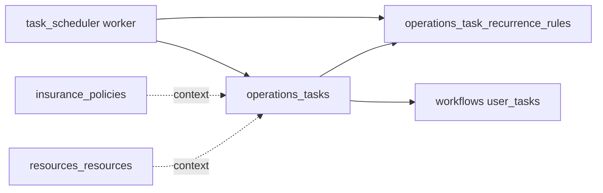

# CRM concierge — resource & policy tasks, recurrence, and scheduler module

## TLDR

Ujednolicić **zadania operacyjne** przypisane do **wielu podmiotów CRM** (co najmniej **`resources_resources`** oraz **`insurance_policies`**) w jednym modelu danych (**wariant B**: tabela **`operations_tasks`** z `context_type` + `context_id`), z **powtarzalnością** (szablon + reguła) oraz modułem **`task_scheduler`** z workerem materializującym kolejne instancje — **bez** dublowania osobnych encji `resources_resource_tasks` + `insurance_policy_tasks` ani wymuszania w tej fazie pełnego scalenia z `ProcurementProcessTask` (to osobny ADR / faza późniejsza).

## Overview

Plan CRM wymaga zakładki zadań na karcie **pojazdu / zasobu** oraz na karcie **polisy** (ten sam UX co zadania w procurement), automatycznego wystawiania zadań cyklicznych (np. mycie, przegląd, przypomnienie odnawiania polisy) oraz możliwości, by w przyszłości **workflow** dla zasobów i polis tworzyły zadania w tym samym kanale. Dziś zadania procurement są sprzężone z `procurement_process_id`. Cel tej specyfikacji: **jedna warstwa `operations_tasks`** obsługująca co najmniej:

| `context_type` (wartość stabilna, FROZEN po wdrożeniu) | `context_id` wskazuje na |
|--------------------------------------------------------|---------------------------|
| `resource` | `resources_resources.id` |
| `insurance_policy` | `insurance_policies.id` |

Rozszerzenia (np. `procurement_process`) — **additive-only**, dopiero po decyzji produktowej i ADR pod migrację lub federację z `ProcurementProcessTask`.

## Problem Statement

1. `ProcurementProcessTask` wymaga `process_id` — nie da się przypiąć zadania wyłącznie do zasobu lub polisy bez sztucznego procesu.
2. Brak wspólnego pola **recurrence** / linku do **schedule definition** dla zasobów i polis.
3. Brak komponentu cron/worker tworzącego kolejne wystąpienia.
4. Osobne tabele per moduł (**wariant A**) podwajają schemat, API, indeksy i regresje przy każdym nowym typie podmiotu (zasób, polisa, później np. szkoda) — przy dwóch encjach CRM już bardziej opłacalny jest **wariant B**.

## Proposed Solution

### Wariant B (wybrany w tej specyfikacji): `operations_tasks`

- **Jedna tabela** (nazwa robocza: `operations_tasks`, moduł roboczy: np. `operations` lub `tasks` — do ustalenia przy implementacji, spójnie z `packages/core/AGENTS.md` i konwencją nazw modułów):
  - `tenant_id`, `organization_id`, `context_type` (text lub enum DB), `context_id` (uuid), `title`, `body`, `task_status`, `due_at`, `assigned_user_id`, `delegated_from_user_id`, `work_item_user_task_id` (nullable, opcjonalne spięcie z workflows), standardowe timestamps + soft delete.
  - **Indeksy:** `(tenant_id, organization_id, context_type, context_id, deleted_at)`, `(due_at)` dla list i schedulera.
  - **Invariant:** `(context_type, context_id)` musi wskazywać na istniejący rekord w danym tenancie (walidacja w commandzie / FK nie cross-module — jak w innych miejscach platformy: tylko UUID + assert w warstwie aplikacji).
- **Recurrence:** tabela `operations_task_recurrence_rules` (lub równoważna nazwa) z `task_template_id` → FK do wiersza `operations_tasks` oznaczonego jako szablon (`is_template boolean` **lub** osobna encja szablonu — decyzja implementacyjna; preferencja: jedna tabela z `is_template` dla prostoty zapytań), polami: `interval_unit` (`day|week|month|year`), `interval_count`, opcjonalnie `rrule_text` (nullable), `ends_at` / `max_occurrences`, `is_active`, `next_materialization_at`.
- **Procurement:** w tej fazie **bez migracji** `ProcurementProcessTask` do `operations_tasks`. UI procurement pozostaje na istniejącym API; ewentualna konwergencja — osobny dokument (ADR) i etap „Phase N”.

### Wariant A (odłożony / porównawczy): symetryczne tabele per moduł

- `resources_resource_tasks` + `insurance_policy_tasks` + osobne reguły recurrence — odrzucone jako domyślna ścieżka z powodu duplikacji przy ≥2 kontekstach CRM.

### Moduł scheduler

- Moduł **`task_scheduler`** w `packages/core/src/modules/task_scheduler/`:
  - Powiązanie z materializacją: np. `task_scheduler_recurring_bindings` z `recurrence_rule_id` (FK do `operations_task_recurrence_rules`), `last_run_at`, `tenant_id`, `organization_id`.
  - Worker ([`packages/queue/AGENTS.md`](../../packages/queue/AGENTS.md)): co N minut wybiera due joby, **idempotentnie** tworzy nowy wiersz `operations_tasks` (instancja) z `due_at` z reguły, aktualizuje `next_materialization_at` na regule.
  - Zdarzenia: np. `task_scheduler.job.fired` (opcjonalnie) dla audytu.
- Scheduler **nie** zastępuje `workflows` dla QC wieloetapowego — tylko **materializacja** zadań checklistowych / przypomnień.

### UI

- Zakładka **„Zadania”** na backend detail **zasobu** oraz **polisy** — ten sam wzorzec co [`procurement/.../processes/[id]`](packages/core/src/modules/procurement/backend/) (DataTable + row actions + CrudForm / drawer), z filtrem po `context_type` + `context_id` (id rekordu z URL).
- Akcja „Ustaw powtarzalność” otwiera formularz reguły; powiązanie z `workflows` UserTask opcjonalne (`work_item_user_task_id`).

## Architecture

## Data Models

| Encja | Opis |
|-------|------|
| `operations_tasks` | Zadanie; scope przez `context_type` + `context_id` (min. `resource`, `insurance_policy`) |
| `operations_task_recurrence_rules` | Reguła powtarzalności + `next_materialization_at`; powiązanie z szablonem zadania |
| `TaskSchedulerRunLog` (opcjonalnie) | Idempotencja po (`rule_id`, `materialized_for` / data okna) |

## API Contracts

- CRUD pod ścieżką spójną z resztą platformy, np. **`/api/operations/tasks`** z query `contextType` + `contextId` (lista), body tworzenia zawiera te same pola — **OpenAPI** obowiązkowe; pola odpowiedzi **additive-only** ([`BACKWARD_COMPATIBILITY.md`](../../BACKWARD_COMPATIBILITY.md)).
- Alternatywa kosmetyczna: cienkie proxy **`/api/resources/.../tasks`** oraz **`/api/insurance/.../tasks`** mapujące na ten sam command — bez drugiej prawdy w DB.
- Scheduler: wewnętrzny worker — brak publicznego API poza admin/debug jeśli potrzebne.

## RBAC

- Zasoby: istniejące `resources.view` / `resources.edit` (lub węższy feature jeśli wydzielony) dla zadań z `context_type=resource`.
- Polisy: feature z modułu `insurance` (np. `insurance.policies.view` / `insurance.policies.manage` — dokładne id per `acl.ts` przy implementacji) dla `context_type=insurance_policy`.
- Opcjonalnie: `task_scheduler.admin` dla konfiguracji globalnej jobów.

## Integration tests

- Utworzenie zadania (resource **oraz** insurance_policy) + reguła co 1 dzień (test przyśpieszony przez `next_materialization_at` w przeszłości lub mock czasu).
- Worker tworzy dokładnie **jedną** nową instancję na tick (idempotencja) dla **obu** typów kontekstu.
- Odmowa zapisu przy `context_id` nie należącym do tenanta / złym typie.
- Powiązanie z workflow UserTask: smoke jeśli workflow włączony w środowisku testowym.

## Risks and Impact Review

| Ryzyko | Ważność | Mitygacja |
|--------|---------|-----------|
| Rozjazd z `ProcurementProcessTask` (dwa światy zadań) | Średnia | Jasna granica faz; ADR przed migracją procurement do `operations_tasks` |
| Polimorfizm bez silnych FK | Średnia | Walidacja w commandzie + testy integracyjne + indeksy po `(context_type, context_id)` |
| Podwójne tworzenie przez worker restart | Wysoka | Unique partial index na (`rule_id`, `materialized_for_date`) lub log run |

## Final Compliance Report

- Brak `ManyToOne` cross-module do encji innych modułów — tylko UUID + walidacja w commandzie.
- `context_type` jako **contract surface** — wartości FROZEN po publikacji; nowe typy tylko additive.
- Scheduler w osobnym module z `setup.ts` i kolejką zgodnie z kontraktem workerów.

## Phasing

1. **`operations_tasks`** + walidacja `resource` / `insurance_policy` + API + UI zakładki na **zasobie** i **polisie**.
2. **Recurrence rule** + zapis + lista szablonów/instancji.
3. Moduł **`task_scheduler`** + worker + testy integracyjne.
4. (Opcjonalnie) Proxy REST pod modułowe ścieżki; wspólna biblioteka UI z procurement.
5. (Osobny ADR) Konwergencja z `ProcurementProcessTask` — poza zakresem pierwszej fazy tej specyfikacji.

## Changelog

| Data | Opis |
|------|------|
| 2026-05-02 | Utworzenie specyfikacji. |
| 2026-05-02 | Rozszerzenie o zadania dla **polis**; wybór **wariantu B** (`operations_tasks` + `context_type` / `context_id`); procurement poza fazą 1; diagram i fazy zaktualizowane. |
