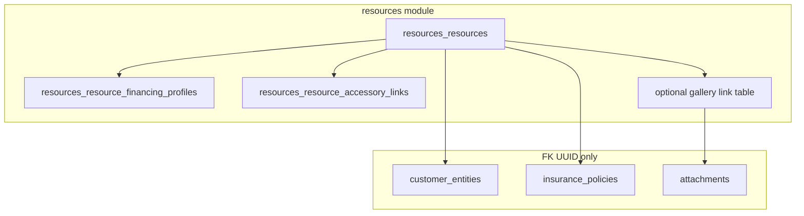

# CRM concierge — resources as vehicle source of truth

## TLDR

Rozszerzyć moduł [`resources`](packages/core/src/modules/resources/) tak, aby **pojazd klienta** (wewnętrzny vs zewnętrzny) był jednoznacznym źródłem prawdy: grupy pól, akcesoria (już częściowo przez `ResourcesResourceAccessoryLink`), załączniki z **osobną sekcją zdjęć** (galeria), **powiązanie z polisą** (UUID, bez relacji ORM do `insurance`), **parametry leasingu / finansowania wyłącznie dla pojazdu wewnętrznego**. Bez nowego modułu `fleet` — całość w `resources` + ewentualnie `ce.ts` / custom fields per typ zasobu.

## Overview

Dokument „CRM procesy” wymaga karty pojazdu bogatszej niż generyczny zasób. W repozytorium `ResourcesResource` już ma `customerEntityId`, `procurementProcessId`, typ zasobu (`resourceTypeId`), oraz **linki akcesoriów** i **książkę serwisową** (`ResourcesResourceServiceBookEntry`). Brakuje bloku finansowania dla wewnętrznego, kanonicznego linku do polisy po stronie zasobu oraz UX **galerii zdjęć** odrębnej od ogólnych załączników.

## Problem Statement

1. Typ zasobu jest tylko `resourceTypeId` — nie wymusza semantyki „wewnętrzny vs zewnętrzny” ani walidacji pól zależnych.
2. Polisa: `InsurancePolicy` ma już `resource_id` ([`insurance/data/entities.ts`](packages/core/src/modules/insurance/data/entities.ts)) — z perspektywy zasobu brak jawnego `primary_policy_id` utrudnia szybkie odczyty i spójność UI.
3. Leasing / finansowanie nie istnieje jako zamodelowany zestaw pól na zasobie.
4. Załączniki globalne nie rozróżniają „dokumenty” vs „zdjęcia pojazdu” bez konwencji (tag, `entity` subtype, lub osobna tabela powiązań).

## Proposed Solution

### A) Klasyfikacja pojazdu

- Zostawiamy jak jest

### B) Grupy pól

- Zostawiamy jak jest

### C) Akcesoria

- Użyć istniejącego [`ResourcesResourceAccessoryLink`](packages/core/src/modules/resources/data/entities.ts): host = pojazd, accessory = osobny `ResourcesResource` (np. zestaw opon) lub uproszczony zasób-akcesorium.

### D) Zdjęcia pojazdu vs pliki ogólne

- **Konwencja załączników:** `attachments` powiązane z encją `resources.resource` + **`metadata.purpose = vehicle_gallery`** (lub dedykowany `attachment_category` jeśli istnieje w module — do weryfikacji przy implementacji).
- **UI:** osobna sekcja na stronie szczegółu zasobu: upload (istniejący komponent) + galeria (sortowanie, `sort_order` w metadata lub osobna tabela `resources_resource_gallery_items` z `attachment_id` + `sort_order` dla deterministycznej kolejności).

### E) Polisa

- Dodać **`insurance_policy_id`** (`uuid`, nullable) na `resources_resources` — **tylko `@Property`**, bez `ManyToOne` do encji `insurance` (zasada cross-module).
- Invariant: jeśli `insurance_policy_id` ustawione, opcjonalna synchronizacja z `InsurancePolicy.resource_id` w **command** (jedna strona jest źródłem prawdy relacji — ustalić: **zasób wskazuje polisę** jako canonical dla CRM concierge; aktualizacja `InsurancePolicy.resource_id` w tym samym commandzie przy zapisie zasobu).
- Resource moze mieć wiele polis, ale musi być wybrana aktualna (aktywna), jest to nadpisywane poprzez dodanie nowej polisy dla pojazdu w module insurance, lub przez wybor polisy z listy powiazanych z danym resource
- Powiazanie polisy tylko i wylacznie dla pojazd wewnetrzny i pojazd zewnetrzny

### F) Leasing / finansowanie (tylko `pojazd wewnetrzny`)

- Nowa tabela w module `resources`: **`resources_resource_financing_profiles`** (1:1 lub 1:N jeśli historia) z polami m.in.: `financing_kind` (lease | loan | cash | other), `term_months`, `vehicle_value_amount`, `installment_amount`, `currency_code`, `valid_from`, `valid_to`, `metadata jsonb`.
- Walidacja: rekord możliwy **tylko** gdy typ resource to pojazd wewnetrzny; API zwraca 422 w przeciwnym razie.

## Architecture

## Data Models (docelowo)

| Tabela / encja | Zmiana |
|----------------|--------|
| `resources_resources` | `insurance_policy_id` (nullable uuid) |
| `resources_resource_financing_profiles` | nowa, `resource_id` FK wewnątrz modułu |
| Opcjonalnie `resources_resource_gallery_items` | `resource_id`, `attachment_id`, `sort_order` |
| `ResourcesResourceAccessoryLink` | bez zmiany schematu w MVP; ewentualnie `role` text dla typu akcesorium |

Wszystkie tabele: `tenant_id`, `organization_id`, `deleted_at` zgodnie z konwencją modułu.

## API Contracts

- CRUD `resources` (istniejący route): rozszerzyć body read/update o `insurancePolicyId`, `financingProfile` (nested), `accessoryLinks` (read-only lub podosobny CRUD jak dziś).
- Nowe endpointy tylko jeśli konieczne: np. `PATCH .../gallery/reorder` dla sortu zdjęć.
- **OpenAPI:** uzupełnić opisy pól; brak breaking removal pól odpowiedzi — tylko additive ([`BACKWARD_COMPATIBILITY.md`](../../BACKWARD_COMPATIBILITY.md)).

## RBAC

- Rozszerzyć [`resources/acl.ts`](packages/core/src/modules/resources/acl.ts) jeśli potrzebne osobne uprawnienia do finansowania lub galerii; domyślnie objęte `resources.edit` / `resources.view`.

## Integration tests (`.ai/qa`)

- Utworzenie zasobu `pojazd wewnetrzny` + financing profile + przypisanie `insurance_policy_id` (fixture polisy przez API insurance jeśli dostępne w teście).
- Próba zapisu financing przy `pojazd zewnetrzny` → oczekiwany błąd walidacji.
- Galeria: upload 2 załączników z metadata, lista, zmiana kolejności.

## Risks and Impact Review

| Ryzyko | Ważność | Mitygacja |
|--------|---------|-----------|
| Rozjazd `resource_id` na polisie vs `insurance_policy_id` na zasobie | Średnia | Jedna transakcja command; test integracyjny |
| Zdjęcia bez osobnej tabeli — chaotyczny sort | Niska | Tabela gallery lub `sort_order` w metadata |
| Nadmierne pola na `resources_resources` | Niska | Finansowanie w osobnej tabeli |

## Final Compliance Report

- Brak relacji ORM cross-module.
- Zmiany additive-only na schemacie.
- Zgodność z Task Router: `packages/core/AGENTS.md`, backend UI rules dla stron `resources/**`.
- Zgodnosc zaimplementowanych komponentow i CRUD z modulami accounting, insurance, customer-v2 oraz naszymi zasadami dotyczacych wizualizacji, pol wyszukujacych i preview

## Phasing

1. Migracja + encje + validators + CRUD response normalization.
2. Backend detail: sekcje field groups + galeria + financing (warunkowo).
3. i18n + integracja testów.

## Changelog

| Data | Opis |
|------|------|
| 2026-05-02 | Utworzenie specyfikacji z planu CRM „CRM procesy”. |
