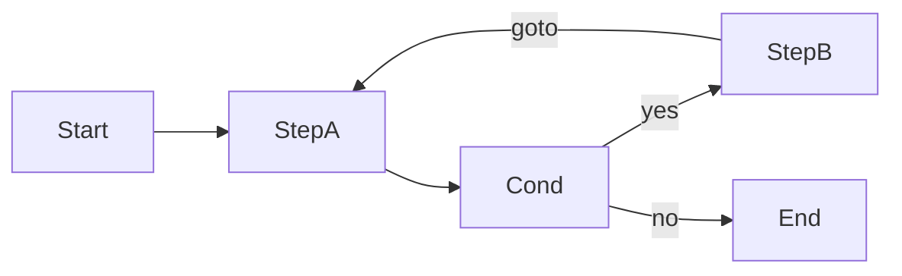
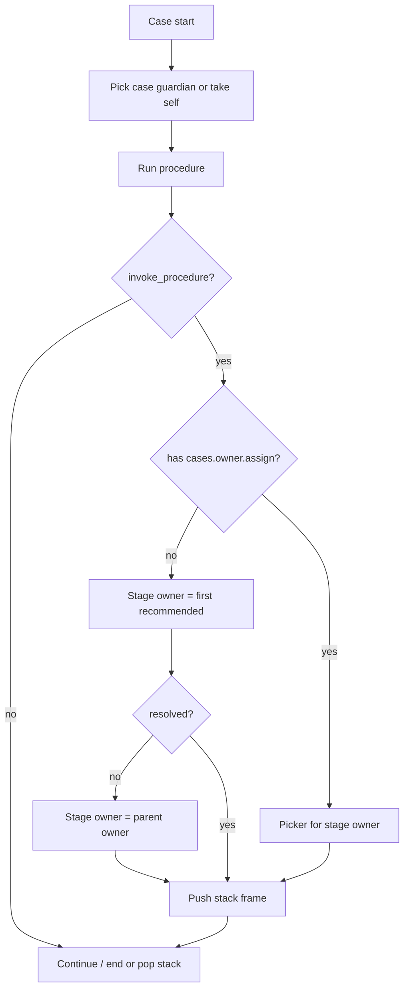
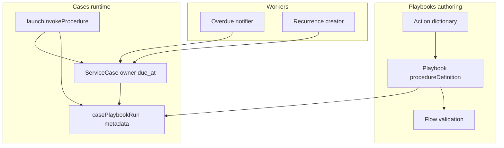

# Playbooks & cases — procedure loops, ownership, action dictionary, SLA, recurrence

## TLDR

**Key Points:**
- Extend **playbooks** procedure authoring and **cases** runtime so real operational flows work: loops/returns in procedures, case and sub-procedure guardians (opiekun), module-level action dictionary with notify flags, deadlines/SLA with overdue alerts, and recurring cases that auto-create ahead of the next due window.
- Ship as additive, phased changes on existing `playbooks` + `cases` modules (no new top-level module).

**Scope:**
- Procedure flow validation: allow cycles; require reachable exit (`end` | `invoke_procedure`)
- Case guardian required at case start (pick or take self); playbook **recommended guardians** list; on sub-procedure launch — auto (first recommended) vs manual pick based on ACL (e.g. manager vs subordinate)
- Changing case owner later remains possible with appropriate permissions (normal case edit — **not** an `invoke` “reassign policy”)
- Playbooks module action dictionary; action blocks reference dictionary codes
- Duration-based SLA on procedure / sub-procedure / case + overdue notification to current owner
- Recurring cases: cycle + lead-time auto-create

**Concerns:**
- **All Open Questions Q1–Q12 decided** (interactive PO pass 2026-07-18) — see Decision column above; ready for phased implementation.
- Call stack (Q1 b) is the largest engine change vs today’s replace-run.

## Open Questions — RESOLVED

> All items decided 2026-07-18. Table retained as decision log (not a gate).

| ID | Question | Options | Decision |
|----|----------|---------|----------|
| **Q1** | After a sub-procedure finishes, do we return to the parent procedure? | (a) No — permanent playbook switch (today) (b) Yes — call stack / resume parent | **DECIDED: (b)** call stack — on sub-procedure `end`, resume parent at next step after `invoke_procedure` |
| **Q2** | How is “can pick guardian manually” determined? | (a) Feature flag e.g. `cases.owner.assign` (b) Role hierarchy / manager-of (c) Both | **DECIDED: (a)** feature `cases.owner.assign`; without it → auto first from recommended list |
| **Q3** | Recommended guardians list: ordered user IDs on playbook, or roles/teams resolved at runtime? | (a) Ordered `userId[]` (b) Role/team refs (c) Mix | **DECIDED: (a)** ordered `userId[]`; order = order of adding to the recommended list (first = auto-pick) |
| **Q4** | Action dictionary lives in which module? Can tenants disable seed codes? | (a) `playbooks` (b) `cases`; disable vs add-only | **DECIDED: (a) + disable** — dictionary in `playbooks`; tenants may disable seed entries |
| **Q5** | What does `notifyOnExecute` emit? | (a) In-app notification (b) messages channel (c) both per dictionary entry | **DECIDED: (c)** per-entry `notifyInApp` + messages channel flags |
| **Q6** | One deadline on the case, or separate case vs current (sub)procedure due? | (a) Single `due_at` on case (b) Case + `procedureDueAt` in run metadata | **DECIDED: (b)** case `due_at` + `procedureDueAt` on active run |
| **Q7** | Overdue alerting? | (a) One-shot (b) Escalation / repeat | **DECIDED: (a)** one-shot + `overdue_notified_at` (case and/or procedure flags) |
| **Q8** | Recurrence “end date” of an occurrence? Must previous case be closed before next create? | (a) Computed due from SLA (b) Explicit occurrence end (c) both; require close yes/no | **DECIDED: (c) + require previous closed** — series rule + optional series end; occurrence due from SLA; next occurrence only after previous is closed |
| **Q9** | Auto-created recurring case: start playbook immediately? | (a) Start on create (b) Draft / `new` only | **DECIDED: (b) + scheduled start** — create at lead-time as `new` (bound playbook, not started); **start at the occurrence’s cycle time** (scheduler), not on create and not left as indefinite manual start |
| **Q10** | Runtime loop limit (anti-infinite goto)? | (a) Graph exit only (b) Max visits per step | **DECIDED: (a)** graph must have reachable exit; no runtime visit cap in MVP |
| **Q11** | On sub-procedure launch: always set case `owner_user_id` to the chosen/auto guardian? | (a) Yes — case owner follows active stage (b) Keep parent case owner; store stage owner separately | **DECIDED: (b) + parent fallback** — case `owner_user_id` stays the case guardian; active-frame / sub-procedure has `procedureOwnerUserId` in run metadata; if sub-procedure owner cannot be resolved → use parent frame’s owner (ultimately case owner) |
| **Q12** | If recommended list is empty on auto path? | (a) Keep current / parent owner (b) Block launch (c) Force picker even without assign ACL | **DECIDED: (a)** stage owner = parent frame owner (else case owner); optional warn in UI |

**Related specs (do not overwrite):**
- [`.ai/specs/2026-05-02-crm-cases-omnichannel.md`](2026-05-02-crm-cases-omnichannel.md)
- [`.ai/specs/2026-05-02-crm-customer-signals-and-playbooks.md`](2026-05-02-crm-customer-signals-and-playbooks.md)

---

## Overview

Operators author multi-step **procedures** on playbooks (conditions, gotos, actions, invoke other playbooks) and execute them on **cases**. Client workshops showed gaps: validation rejects legitimate loops; guardians must be chosen at case start and guided (not hard-locked) via recommended lists when entering sub-procedures; actions are hard-coded variants instead of a tenant dictionary; there is no SLA/overdue path; cases cannot recur.

This spec defines product rules and platform design to close those gaps while staying additive under [`BACKWARD_COMPATIBILITY.md`](../../BACKWARD_COMPATIBILITY.md).

**Market reference:** BPMN / Camunda-style process graphs allow cycles if every token can reach an end event; ITSM (e.g. Jira Service Management) uses assignees with suggested queues; SLA clocks and recurrence (scheduled issue create) are standard. We adopt **reachable-exit** validation (not “DAG-only”), **recommended guardians + ACL-gated manual pick** (not a fixed “reassign” step policy), **dictionary-driven actions**, and **scheduled overdue / recurrence workers**. We reject full BPMN engine rewrite and nested case-per-subprocedure until Q1 demands a stack.

## Problem Statement

1. **Loops blocked:** [`procedureFlowValidation.ts`](../../packages/core/src/modules/playbooks/lib/procedureFlowValidation.ts) fails with `flowCycle` when a path revisits a step (e.g. condition → work → goto earlier step). Client flows require returns; only requirement is an eventual exit via `end` or `invoke_procedure`.
2. **Guardian gaps:** `ServiceCase.ownerUserId` exists, but create UI does not require choosing/taking ownership at start. Playbooks have no **recommended guardians** list. On `invoke_procedure`, ownership always stays as-is — cannot model stage specialists (storage / insurance / detailing) via auto-first-recommended vs manager manual pick. Changing owner mid-case with ACL is fine; we do **not** introduce an invoke-only “reassign policy” flag.
3. **Actions not dictionary-backed:** Action blocks use inline `actionVariant: notify | task | other`. Client wants module settings dictionary and per-action notify behavior.
4. **No SLA:** Cases have `opened_at` / `closed_at` only. No procedure/sub-procedure duration, no overdue notify to guardian.
5. **No recurrence:** Cases are one-shot; no cycle or lead-time auto-create.

## Proposed Solution

### Design Decisions

| Decision | Rationale |
|----------|-----------|
| Allow graph cycles; require path to terminal from every Start-reachable node | Matches client rule; reuses existing terminal concept (`end`, `invoke_procedure`) |
| **Q1 (b)** Call stack for invoke / resume parent | Client decision 2026-07-18 |
| No `ownerPolicy: reassign` on invoke — recommended list + ACL | Client: pick/take at start; recommend per process; auto vs manual by permission |
| Recommended guardians on playbook (ordered `userId[]`, authoring order) | Client: order established by adding to the list; first = auto-pick |
| Action dictionary under **playbooks**; tenants may disable seed | Client Q4 2026-07-18 |
| Shared duration type `{ amount, unit }` | One UX for SLA, lead-time, recurrence intervals |
| Queue workers for overdue + recurrence | Idempotent, tenant-safe, no request-path cron |

### Alternatives Considered

| Alternative | Why rejected (for now) |
|-------------|------------------------|
| Ban cycles, force linear + duplicate steps | Rejected by client |
| Spawn child case per sub-procedure | Heavier UX/data; stack on same case preferred (Q1 b) |
| Permanent playbook replace on invoke (legacy) | Superseded by Q1 (b) call stack |
| Hard-code more action variants | Does not meet dictionary requirement |
| Per-block-only notify flags without catalog | Client asked for module-level dictionary |
| `ownerPolicy: inherit \| reassign` on invoke block | Client rejected “reassign” as the model; ownership change is ACL + recommended list |

### 1. Procedure flow validation (loops)

**Change:** Remove `flowCycle` rejection.

**Keep / strengthen:**
- Every Start-reachable step must be able to reach a terminal (`end` | `invoke_procedure`) — graph reachability (visited set), not stack-acyclicity.
- Invalid goto target, terminal-not-last, must start with Start.

**Tests:** loop with conditional exit → OK; closed loop with no terminal → `flowDoesNotTerminate`.

### 2. Case guardian + recommended guardians (no invoke “reassign”)

**A. Case start (required)**
- When a case is started / playbook is bound for execution: operator must **choose a guardian** or **take the case** (current user → `ownerUserId`).
- Empty owner is not allowed for procedure progress (align UI with existing `assertOwner`).
- Later ownership changes: normal case update, gated by permissions (e.g. `cases.edit` / `cases.owner.assign`) — not a special invoke flag.

**A2. Assign procedure owner when missing (`cases.edit`)**
- `cases.playbook.start` accepts optional `ownerUserId`: when the actor has `cases.edit`, use the body value; otherwise fall back to case `ownerUserId`. Still fail with `cases.procedure.ownerRequired` if unresolved.
- UI at start: user picker defaulting to case owner (operator may pick another user before start).
- Mid-run: if `procedureOwnerUserId` is **empty**, `cases.playbook.assignProcedureOwner` sets it (and case `ownerUserId` when the case has no owner). Fail closed if procedure owner is **already set** (no mid-run reassign via this path).
- While `needsProcedureOwner` (started && no `procedureOwnerUserId`), procedure step actions (`next`, schedule task, notify, answer, invoke) stay blocked until assign.
- Invoke-stage override remains gated by `cases.owner.assign` (unchanged).

**B. Recommended guardians on the process (playbook)**
- Playbook metadata: ordered `recommendedOwnerUserIds: string[]` (Q3 default).
- UI: suggest these users first in pickers; **does not restrict** selecting someone else when the actor has assign permission.
- Target playbook of a sub-procedure may define its own recommended list (specialists for storage / insurance / detailing).

**C. Launching a sub-procedure (`invoke_procedure`) — Q11 (b)**
- Optional `slaDuration` on the block (see §4) — **no** `ownerPolicy: reassign`.
- **Case `ownerUserId` does not change** for stage handoff; it remains the case-level guardian.
- Each call-stack frame stores `procedureOwnerUserId` (stage owner). Overdue / step ACL for the active frame use this field (fallback to case owner when unset).
- Resolve stage owner from the **invoked** playbook’s recommended list:
  - **Without** `cases.owner.assign`: **automatic** — first recommended user; if unresolved/empty → **parent frame’s `procedureOwnerUserId`**, else case `ownerUserId` (Q11 + Q12).
  - **With** `cases.owner.assign`: **manual** picker (recommended first); may choose another user as stage owner.
- Notify the new **stage** owner when it differs from the previous frame’s owner.
- Example: case owned by designer; invoke “car storage” → stage owner = warehouse specialist; case owner stays designer; if storage has no recommended list → stage owner = designer (parent).

### 3. Action dictionary (module settings)

- Dictionary key e.g. `playbooks.procedure.action` (ensure + seed via playbooks settings page / API pattern used for procedure status).
- Entry metadata: `notifyInApp`, `notifyViaMessages` (and channel defaults), `enabled`, optional `legacyVariant`
- Seed: `notify`, `task`, `other` matching today’s variants.
- Action block: prefer `actionCode`; keep reading legacy `actionVariant` for BC.
- Execute: if dictionary says notify → in-app and/or messages path.

### 4. Deadlines / SLA + overdue

**Duration:** `{ amount: positive int, unit: 'hours' | 'days' | 'weeks' | 'months' }`.

| Level | Storage | Clock starts |
|-------|---------|--------------|
| Playbook / procedure default | playbook metadata or version field | playbook run start |
| Sub-procedure | on `invoke_procedure` block | invoke launch |
| Case | `due_at` column (nullable) | case open / create (from case or playbook default) |

**Runtime (Q6 decided b):** set/update case `due_at` and `metadata.casePlaybookRun.procedureDueAt` (and nested-frame dues when on call stack). Worker finds open cases / active runs past due without overdue notified flags → notify current `ownerUserId` → set flags.

### 5. Recurring cases

**Series fields** (on case template or dedicated series entity — prefer additive columns on case + `recurrence_series_id` linking occurrences):
- `recurrence_enabled`, rule (`interval` + `unit` or preset), optional series end,
- `create_lead_time` duration,
- default playbook id/slug, default owner user id / recommended list from playbook,

**Worker:** (1) After previous occurrence is **closed**, in the **lead-time** window before the next occurrence, create the next case (idempotent), bind playbook, leave unstarted. (2) At the **occurrence cycle time**, auto-**start** the playbook on that case.

## User Stories / Use Cases

- **Operator** wants to **author a procedure with “retry step” loops** so that **real purchase flows validate and save**.
- **Operator** wants to **set a guardian when opening a case** (pick or take self) so that **work is owned from the start**.
- **Process author** wants to **define recommended guardians on a playbook** so that **stage specialists are suggested** without locking the picker.
- **Manager** wants to **manually choose who owns a sub-procedure** so that **they can assign a subordinate**.
- **Subordinate** wants **sub-procedure ownership to resolve automatically** from the recommended list so that **they are not forced to pick**.
- **Admin** wants to **configure available procedure actions in module settings** so that **tenants share a consistent action catalog with notify rules**.
- **Guardian** wants to **get notified when SLA is breached** so that **overdue work is visible**.
- **Ops** wants to **mark a case series as recurring** so that **the next occurrence is created automatically before the due window**.

## Architecture

### Commands & Events

| Kind | ID | Notes |
|------|-----|--------|
| Command | `cases.case.create` / update | Accept `ownerUserId` (required for start); recurrence fields; owner change with ACL |
| Command | `cases.playbook.start` | Require owner; compute due |
| Command | `cases.playbook.launch_invoke` | Resolve owner: auto first recommended **or** body `ownerUserId` when actor has assign ACL |
| Event | `cases.case.owner_changed` | On any permitted owner change (start, invoke, edit) |
| Event | `cases.case.overdue` | Worker; `clientBroadcast` optional |
| Event | `cases.case.recurrence_created` | New occurrence |
| Notification | `cases.case.overdue` / `cases.case.owner_assigned` | To guardian |

Feature IDs (additive): reuse `cases.*`, `playbooks.settings.manage`; add `cases.owner.assign` (manual guardian pick on invoke / elevated assign); add `cases.recurrence.manage` if needed.

## Data Models

### Duration (shared value object — not a table)

- `amount`: number (int ≥ 1)
- `unit`: `'hours' | 'days' | 'weeks' | 'months'`

### ServiceCase (additive columns)

- Existing: `owner_user_id`, `opened_at`, `closed_at`, …
- Add: `due_at` (timestamptz, nullable)
- Add: `overdue_notified_at` (timestamptz, nullable)
- Add recurrence (nullable when one-shot):
  - `recurrence_enabled` (bool, default false)
  - `recurrence_series_id` (uuid, nullable) — shared across occurrences
  - `recurrence_interval_amount` / `recurrence_interval_unit` (or jsonb `recurrence_rule`)
  - `recurrence_create_lead_time` (jsonb duration)
  - `recurrence_occurrence_key` (text, nullable) — idempotency within series

### Playbook procedure blocks (JSON, additive)

**`invoke_procedure`:**
- `slaDuration?: Duration`
- (No `ownerPolicy` — ownership uses recommended list + ACL at runtime.)

**Playbook / version metadata:**
- `defaultSlaDuration?: Duration`
- `recommendedOwnerUserIds?: string[]` — ordered suggestions for this process / stage

**`action`:**
- `actionCode?: string` (dictionary code)
- Keep `actionVariant` for BC

### Action dictionary entry (via dictionaries module)

- Key: `playbooks.procedure.action`
- Entry: `value` = code; label; organization/tenant scoped
- Metadata: `notifyInApp`, `notifyViaMessages`, channel defaults, `enabled`, `legacyVariant`

### casePlaybookRun metadata (additive)

- Call stack frames: `stack: Array<{ playbookId, currentBlockId, procedureOwnerUserId?, procedureDueAt?, … }>`
- Active frame: `procedureOwnerUserId`, `procedureDueAt`, `procedureOverdueNotifiedAt`
- Existing top-level fields may mirror the active frame for BC
- On pop: restore parent frame; case `ownerUserId` unchanged (Q11 b)

## API Contracts

### Cases create / update

- `POST /api/cases`, `PUT/PATCH /api/cases/:id`
- Request additive: `ownerUserId`, `dueAt` (optional override), recurrence fields
- Response: same fields

### Procedure launch invoke

- Existing procedure action endpoint (extend body):
  - `ownerUserId?: uuid` — allowed/required when actor has `cases.owner.assign`; ignored on auto path (server picks first recommended)
- Response / errors: `cases.procedure.ownerRequired`, `cases.procedure.ownerAssignForbidden` if body tries to override without ACL

### Playbooks recommended owners

- Set via playbook create/update metadata (or dedicated field on playbook entity if preferred over metadata JSON)
- Editor UI: ordered multi-user picker

### Playbooks action dictionary

- Ensure: `GET /api/playbooks/dictionaries/procedure-action` (mirror procedure-status ensure)
- CRUD entries via existing dictionaries APIs

### Internal workers (not public REST)

- Overdue scanner job (queue / scheduler)
- Recurrence creator job

## Internationalization (i18n)

- `playbooks.procedure.validation.flowDoesNotTerminate` (keep; retire or stop emitting `flowCycle`)
- `cases.form.owner`, `cases.form.takeOwnership`, `cases.form.assignOwner`
- `playbooks.form.recommendedOwners`, `cases.procedure.owner.autoAssigned`, `cases.procedure.owner.pickRequired`
- `playbooks.config.actions.*` (dictionary UI)
- `cases.sla.*`, `cases.overdue.*`, `cases.recurrence.*`

## UI/UX

- **Playbook editor:** allow save of looping graphs; clearer error only when no exit; playbook-level recommended owners; invoke block: optional SLA; action block: pick from dictionary.
- **Playbooks settings:** action dictionary section (like status dictionary).
- **Case create / detail:** required owner path (pick or take self); later change owner if permitted; SLA display; recurrence section when enabled.
- **Invoke launch:** if actor has `cases.owner.assign` → guardian picker (recommended first); else toast/banner that owner was auto-set to first recommended (when list non-empty).

## Configuration

- No new env vars required for MVP.
- Tenant dictionaries + playbook metadata hold behavior.
- Scheduler/queue must be enabled in deployment for overdue + recurrence (document in ops notes).

## Migration & Compatibility

- DB: additive columns only on `cases` (and indexes on `due_at`, `recurrence_series_id`).
- JSON procedure definitions: additive optional fields; legacy action blocks without `actionCode` still work via `actionVariant`.
- Validation: previously invalid cyclic flows become savable — intentional product change, not a remove of API surface.
- Deprecate user-facing `flowCycle` message once unused; keep code string unused or map to no-op for one minor if clients parse codes.

## Implementation Plan

### Phase 0 — Flow loops (P0)

1. Update `dfsAllPathsTerminate` / validation to allow cycles; keep terminal reachability.
2. Unit tests: valid loop, invalid no-exit loop, night-path gotos.
3. i18n: stop surfacing `flowCycle` for legal loops.

### Phase 1 — Ownership (P1)

1. Case create/start: required owner (pick or take self); case edit owner with ACL.
2. Playbook metadata: `recommendedOwnerUserIds` + editor UI.
3. Call-stack-aware `launchInvokeProcedure`: stage `procedureOwnerUserId` auto/manual; parent fallback; notify stage owner.
4. Integration: start without owner fails; subordinate auto-assign; manager manual pick; empty list → parent.

### Phase 2 — Action dictionary (P2)

1. Ensure dictionary + seed + settings UI.
2. Editor binds `actionCode`; runtime resolves notify flag.
3. BC path for `actionVariant`.

### Phase 3 — SLA / overdue (P3)

1. Duration helpers; playbook + invoke + case `due_at`.
2. Worker + notification type + idempotency flag.
3. Tests: overdue fires once; closed cases skipped.

### Phase 4 — Recurrence (P4)

1. Series fields + UI.
2. Recurrence worker + idempotent create.
3. Integration: lead-time create without duplicate.

### File Manifest (indicative)

| File | Action | Purpose |
|------|--------|---------|
| `packages/core/src/modules/playbooks/lib/procedureFlowValidation.ts` | Modify | Allow cycles |
| `packages/core/src/modules/playbooks/lib/procedureBlocks.ts` | Modify | `slaDuration`, `actionCode`; playbook recommended owners schema |
| `packages/core/src/modules/playbooks/lib/dictionaryKeys.ts` | Modify | Action dictionary key |
| `packages/core/src/modules/playbooks/components/PlaybookProcedureStepsEditor.tsx` | Modify | Editor fields + recommended owners |
| `packages/core/src/modules/cases/data/entities.ts` | Modify | `due_at`, recurrence, overdue flag |
| `packages/core/src/modules/cases/commands/caseProcedure.ts` | Modify | Owner resolve on invoke / due |
| `packages/core/src/modules/cases/acl.ts` | Modify | `cases.owner.assign` |
| `packages/core/src/modules/cases/components/*` | Modify | Create owner, invoke picker, SLA, recurrence UI |
| `packages/core/src/modules/cases/workers/*` | Create | Overdue + recurrence |
| `packages/core/src/modules/cases/notifications.ts` | Modify | New notification types |

### Testing Strategy

- **Unit:** flow validation graphs; duration → dueAt; dictionary resolve; owner resolve (auto vs manual ACL); idempotent overdue/recurrence keys.
- **Integration (per `.ai/qa/AGENTS.md`):** save looping procedure; create case with required owner; invoke auto-assign; invoke manual assign with feature; overdue notification; recurrence create once.

### Integration coverage (must list in QA)

| Area | Paths |
|------|--------|
| Playbooks API | Procedure save with loop; dictionary ensure; recommended owners |
| Cases API | Create with owner; procedure invoke owner resolve; due fields |
| UI | Case create owner; invoke auto vs picker; settings actions |

## Risks & Impact Review

### Data Integrity Failures

- Mid-flight invoke + owner update: single command transaction; if notify fails after owner change, case remains consistent (notify retry via events).
- Concurrent owner edits: last-write-wins on `owner_user_id`; document; optional optimistic version later.

### Cascading Failures & Side Effects

- Overdue worker storm: batch + idempotency flag; rate-limit per tenant.
- Recurrence duplicates: unique `(recurrence_series_id, recurrence_occurrence_key)`.

### Tenant & Data Isolation Risks

- All queries filter `organization_id` + `tenant_id`; workers must scope by org.
- Dictionaries already org-scoped.
- Recommended owner IDs must be validated as users in the same tenant/org.

### Migration & Deployment Risks

- Additive columns — online safe.
- No backfill required for loops; optional backfill `due_at` null.

### Operational Risks

- Without scheduler, SLA/recurrence silently idle — document dependency.
- Infinite operator goto loops: accepted (Q10); monitor step transition counts if abuse appears.
- Empty recommended list + auto path: keep current owner (Q12) — may leave wrong specialist; surface warning.

### Risk Register

| Failure Scenario | Severity | Affected Area | Mitigation Strategy | Residual Risk | Detection Method | Owner |
|------------------|----------|---------------|---------------------|---------------|------------------|-------|
| Cyclic procedure with no exit saved due to bug | High | Playbooks validation | Unit tests + reachability DFS | Low | Save API errors / QA | playbooks |
| Wrong guardian after auto-assign | High | Cases ownership | Ordered recommended list + notify + audit event | Medium until Q2/Q3/Q12 | Timeline / notifications | cases |
| Subordinate overrides owner without ACL | High | Cases ACL | Server-side enforce `cases.owner.assign` | Low | Authz tests | cases |
| Duplicate recurring cases | High | Cases recurrence | Idempotency key + unique index | Low | DB unique violation metrics | cases |
| Overdue notify spam | Medium | Notifications | `overdue_notified_at` one-shot (Q7) | Low if Q7 stays one-shot | Notify volume alerts | cases |
| Legacy playbooks break on action dictionary | Medium | Playbooks BC | Keep `actionVariant` fallback | Low | Regression tests | playbooks |
| Scheduler down → missed SLA/recurrence | Medium | Ops | Health check / job heartbeat | Medium | Job lag metrics | platform |

## Final Compliance Report

### Naming & Structure Compliance

- Modules remain plural: `playbooks`, `cases`.
- Events/commands singular entity: `cases.case.*`, `playbooks` procedure stays JSON on playbook entity.
- Tables/columns snake_case; additive only.

### Architectural Compliance

- No cross-module ORM relations; owner is user UUID FK id only.
- Organization + tenant scoping on cases and dictionaries.
- Side effects (notify, overdue) via commands/events/workers — not ad-hoc cross-module writes.

### Security & Access Compliance

- Declarative features for settings and case edit; elevate guardian pick with `cases.owner.assign`; without it invoke auto-assigns from recommended list.
- No secrets in procedure JSON.

### Undoability Compliance

- Owner change (start / invoke / edit): update command should support undo via previous `ownerUserId` in command snapshot where command pattern already used.
- Recurrence create: soft-delete / cancel occurrence; do not hard-delete series history without command.

### Compliance Summary

- **Ready for implementation** Phases P0–P4; Open Questions Q1–Q12 resolved 2026-07-18.
- Spec is implementation-accurate against current code paths cited above, with call-stack as the main delta vs today’s invoke.

## Phasing Summary

| Phase | Name | Gate |
|-------|------|------|
| P0 | Flow loops | Cleared |
| P1 | Ownership + call stack | Cleared (Q1–Q3, Q11–Q12) |
| P2 | Action dictionary | Cleared (Q4–Q5) |
| P3 | SLA / overdue | Cleared (Q6–Q7) |
| P4 | Recurrence | Cleared (Q8–Q9) |

## Changelog

| Date | Description |
|------|-------------|
| 2026-07-18 | Initial specification from client workshop: loops, guardians, action dictionary, SLA, recurring cases; open questions Q1–Q10 with proposed defaults. |
| 2026-07-18 | Ownership model revised: drop invoke `reassign` policy; require guardian at case start; playbook recommended owners; auto (first recommended) vs manual pick via `cases.owner.assign`; add Q11–Q12. |
| 2026-07-18 | **Q1 = (b)** call stack for sub-procedures (resume parent after nested `end`). |
| 2026-07-18 | **Q2 = (a)** manual owner pick via feature `cases.owner.assign`. |
| 2026-07-18 | **Q3 = (a)** ordered recommended `userId[]` (order of adding to the list). |
| 2026-07-18 | **Q4 = (a) + disable** — action dictionary in playbooks; seed entries can be disabled. |
| 2026-07-18 | **Q5 = (c)** notify on execute: in-app and/or messages per dictionary entry. |
| 2026-07-18 | **Q6 = (b)** case `due_at` + procedure/sub-procedure `procedureDueAt`. |
| 2026-07-18 | **Q7 = (a)** one-shot overdue notification. |
| 2026-07-18 | **Q8 = (c) + require previous closed** before next recurrence create. |
| 2026-07-18 | **Q9 = (b) + scheduled start** — create early unstarted; start at cycle occurrence time. |
| 2026-07-18 | **Q10 = (a)** no runtime loop visit cap; graph exit validation only. |
| 2026-07-18 | **Q11 = (b) + parent fallback** — case owner stable; stage owner in run metadata; else parent owner. |
| 2026-07-18 | **Q12 = (a)** empty recommended list → parent/case owner as stage owner. |
| 2026-07-18 | Open Questions Q1–Q12 fully resolved; implementation gates cleared. |
| 2026-07-18 | Implemented P0–P4: flow loops; call-stack invoke + stage owners; action dictionary seed/settings; SLA + overdue worker/notify; recurrence create/start workers; UI for owners/SLA/recurrence/invoke assign. |
| 2026-09-04 | **Assign when missing:** start accepts `ownerUserId` (`cases.edit`); mid-run `assignProcedureOwner` only when `procedureOwnerUserId` empty; no reassign when already set; UI pickers default to case owner. |
