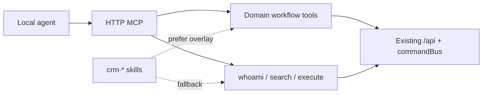

# Domain MCP tools for remaining CRM modules

## TLDR

**Key Points:**
- Hybryda: **first-class workflow tools** (jak `playbooks_*`) dla krytycznych domen + **Code Mode** (`search`/`execute`) jako fallback dla całej powierzchni OpenAPI.
- Spec obejmuje **wszystkie** skilli `crm-*` (inwentarz + konwencje); implementacja first-class idzie falami.
- W skillach ścieżka preferred = nazwane toole, gdy istnieją; Code Mode = fallback (Q5=B).

**Decisions (locked):**
| Q | Choice |
|---|--------|
| Q1 | **C** — hybryda (first-class dla krytycznych, Code Mode dla reszty) |
| Q2 | **B** — wszystkie domeny `crm-*` w zakresie tej spec (inwentarz) |
| Q3 | **C** — workflow domenowy, nie generyczny CRUD 1:1 z REST |
| Q4 | **C** — HTTP MCP teraz; stdio bridge later / out of v1 |
| Q5 | **B** — skilli preferują first-class tools; Code Mode = fallback |

**Scope:**
- Konwencje nazewnictwa, ACL, rejestracja `ai-tools.ts`
- Inwentarz tooli per domena (existing / wave 1–3 / Code Mode only)
- Aktualizacja skilli `crm-*` + cross-ref do `2026-07-18-remote-crm-mcp-agent.md`
- Fazy implementacji + kryteria „kiedy dodać first-class tool”

**Out of scope (v1):**
- Generowanie toola per endpoint OpenAPI
- Stdio remote bridges (poza istniejącym `playbooks mcp:remote`)
- Nowe endpointy HTTP tylko „pod MCP” (toole wołają istniejące API / commandBus)

**Concerns:**
- Nie rozsadzić Context Window agentów setkami tooli — limit first-class do workflow, nie CRUD mirror.

---

## Overview

Lokalny agent (Cursor / Claude) łączy się z HTTP MCP Open Mercato (`yarn mcp:dev` / `mcp:serve`). Platforma już daje `context_whoami`, `search`, `execute` oraz first-class `playbooks_*` i część `inbox_ops_*` / `search_*`.

Ta spec **usztywnia**, jak pozostałe domeny CRM (mapa skilli `crm-*`) dostają:
1. **Workflow overlays** — mały zestaw nazwanych tooli MCP dla operacji wielokrokowych / DSL / przejść stanów.
2. **Code Mode contract** — obowiązkowy fallback przez OpenAPI dla wszystkiego innego.
3. **Skill preference** — dokumentacja „Preferred tools” przed `execute`.

**Market reference:** Anthropic/OpenAI MCP ecosystems preferują *few high-signal tools* + resource/API discovery, nie 1:1 REST mirroring. Adoptujemy ten model; odrzucamy auto-generację toola z każdego path OpenAPI (już pokryte przez Code Mode w `2026-07-18-remote-crm-mcp-agent.md`).

## Problem Statement

1. Sam Code Mode wymaga od agenta ponownego odkrywania OpenAPI przy każdym workflow — drogie i podatne na błędy pól.
2. Playbooks pokazały wartość **nazwanych** tooli dla powtarzalnych, nienatywnych dla CRUD operacji (MD compile/import/export).
3. Brak wspólnych kryteriów: które domeny dostają overlays, jak je nazywać, jak aktualizować skilli bez duplikacji REST.
4. `inbox_ops` / `search` mają już `ai-tools.ts`, ale nie są spięte z mapą skilli `crm-*` ani z preferencją Q5.

## Proposed Solution

### Design decisions

| Decision | Rationale |
|----------|-----------|
| Hybryda (nie full CRUD tools) | Code Mode już pokrywa CRUD; first-class tylko tam, gdzie skraca multi-step / DSL / state machine |
| Wszystkie `crm-*` w inwentarzu | Jedna mapa prawdy dla agentów i reviewerów |
| HTTP only w v1 | Stdio to osobny koszt utrzymania; playbooks stdio zostaje wyjątkiem |
| Skills: tools preferred | Stabilniejsze ścieżki operacyjne; `execute` gdy brak toola lub nietypowy edge case |
| Tool woła API / commandBus | Bez nowych „MCP-only” mutacji — ACL = te same feature IDs |

### Alternatives considered

| Alternative | Why rejected |
|-------------|--------------|
| Tool per OpenAPI path | Eksplozja tooli; sprzeczne z remote-crm-mcp |
| Tylko dokumentacja Code Mode | Nie rozwiązuje friction workflow (Q3=C) |
| Stdio dla każdej domeny od razu | Q4=C — later |

### When to add a first-class tool

Dodaj tool tylko jeśli spełnia **≥2**:
1. Multi-step lub kompilacja / walidacja poza jednym REST call
2. Częsty happy-path w skillu (>1× na typową sesję agenta)
3. Łatwo o błąd pól przy czystym `execute` (status machines, required side fields)
4. Idempotentny / dry-run sensowny (jak `playbooks_compile_markdown`)

**Nie** dodawaj toola dla: prostego list/get z jednym query param; one-off admin; rzadkich edge case’ów.

### Naming

```
<module>_<verb>[_<object>]
```

- `module` = folder / skill module id (`cases`, `customers`, `sales`, `inbox_ops`, …)
- `verb` = `list` | `get` | `find` | `ensure` | `transition` | `assign` | `compile` | `import` | `export` | `apply` | domain verb
- Singular entity in name when needed (`customers_ensure_person`)
- Alias tools dozwolone (jak `playbooks_apply_markdown` → import) — dokumentuj w opisie

### Registration

- Plik: `packages/<pkg>/src/modules/<module>/ai-tools.ts` → `export const aiTools`
- Auto-load przez istniejący loader MCP (`loadAllModuleTools`)
- Każdy tool: `name`, `description`, `inputSchema` (zod), `requiredFeatures[]`, `handler`
- Handler: tenant/org z MCP context; `commandBus` / istniejące lib helpers; **bez** cross-module ORM relations

### Skill preference rule (Q5=B)

W każdym `crm-*` skillu sekcja **Preferred tools**:
1. Najpierw first-class (gdy zaimplementowane)
2. Potem `search` + `execute` z `describeEndpoint`
3. Zakaz hardcodowania UUID — zawsze list/find najpierw

---

## Architecture

```
Cursor / Claude
    │  HTTP /mcp  + x-api-key (OPEN_MERCATO_MCP_API_KEY)
    ▼
MCP HTTP (mcp:dev | mcp:serve)
    ├── Platform: context_whoami, search, execute
    ├── Existing: playbooks_*, inbox_ops_*, search_*
    ├── Wave 1+: cases_*, customers_* , …
    └── execute → fetch(APP_URL + /api/…)  [fallback]
```



### Commands & events

- Mutacje wyłącznie przez istniejące command IDs / API routes modułu.
- Nowe eventy **nie** są wymagane przez tę spec (chyba że konkretny tool wprowadzi nowy workflow — wtedy osobny changelog w module).

---

## Data Models

Brak nowych tabel. Toole operują na istniejących encjach modułów (`cases`, `customers`, …). Payloady tooli = projekcje (id, slug, title, status, …) — **nie** pełny dump ORM.

---

## Domain inventory (wszystkie `crm-*`)

Legenda statusu:
- **Existing** — `ai-tools.ts` już jest
- **Wave 1 / 2 / 3** — planowane first-class workflow tools
- **Code Mode** — tylko skill + `search`/`execute` (na razie)

| Skill | Modules | Status | First-class workflow tools (plan) |
|-------|---------|--------|-----------------------------------|
| `remote-crm-mcp` | platform | Existing | `context_whoami`, `search`, `execute` |
| `crm-cases-playbooks` | `playbooks` | Existing | `playbooks_compile_markdown`, `playbooks_import_markdown` / `apply`, `playbooks_export_markdown`, `playbooks_list`, `playbooks_get` |
| `crm-cases-playbooks` | `cases` | **Done (Wave 1)** | `cases_find`, `cases_get`, `cases_create_with_playbook`, `cases_transition_stage`, `cases_assign_owner` |
| `crm-customers` | `customers`, `customer_signals`, `customer_accounts`, `portal` | **Done (Wave 1)** | `customers_find`, `customers_ensure_person`, `customers_ensure_company`, `customers_get` |
| `crm-inbox-integrations` | `inbox_ops` | Existing | `inbox_ops_*` (już w module) — skill musi je preferować |
| `crm-inbox-integrations` | `messages`, `notifications`, `webhooks`, `integrations`, `data_sync`, `workflows`, `events`, `scheduler`, … | Code Mode → **Wave 3** selective | Tylko jeśli spełni kryteria (np. `workflows_signal`, `data_sync_trigger`) |
| `crm-catalog-sales` | `catalog`, `sales`, `currencies`, `checkout`, gateways | **Wave 2** | `sales_find_document`, `sales_advance_document` (Quote→Order→Invoice wg istniejącego flow), `catalog_find_product` |
| `crm-insurance-partners` | `insurance`, `insurance_desk`, `partner_programs`, `lead_intake` | **Wave 2** | `lead_intake_submit` / desk workflow tools (mapowane 1:1 do istniejących API) |
| `crm-operations` | `resources`, `planner`, `procurement`, `accounting`, `attachments`, `audit_logs`, `query_index` | Code Mode → **Wave 3** | Selective: np. `procurement_transition_process`, `resources_find_allocation` |
| `crm-operations` | `search` | Existing | `search_*` tools — skill preferuje je przed raw API |
| `crm-directory-auth` | `auth`, `directory`, `api_keys`, `staff` | Code Mode | Zwykle admin; first-class tylko jeśli pojawi się powtarzalny agent workflow |
| `crm-config-platform` | `configs`, `dictionaries`, `feature_toggles`, `entities`, … | Code Mode | Odkrywanie przez `execute`; unikaj write tooli bez silnej potrzeby |

### Wave 1 tool contracts (normative sketch)

#### `cases_find`
- **Input:** `{ search?: string, status?: string, page?: number, pageSize?: number }`
- **Features:** `cases.view`
- **Behavior:** GET `/api/cases` (lub równoważny list) z scope org; zwróć id, title, status, customer refs

#### `cases_get`
- **Input:** `{ id: uuid }`
- **Features:** `cases.view`

#### `cases_create_with_playbook`
- **Input:** `{ title, customerEntityId, playbookId | playbookSlug, …pola wymagane OpenAPI }`
- **Features:** `cases.create` (+ ewent. playbooks.view do resolve slug→id)
- **Behavior:** resolve playbook → POST create case z bindingiem procedury (istniejący flow)

#### `cases_transition_stage`
- **Input:** `{ id, toStage | toStatus }` (nazwy wg słownika / API cases)
- **Features:** `cases.edit`
- **Behavior:** wyłącznie dozwolone przejścia z backendu; błąd = czytelny message

#### `cases_assign_owner`
- **Input:** `{ id, ownerUserId }`
- **Features:** `cases.owner.assign` lub `cases.edit` (zgodnie z `acl.ts`)

#### `customers_find`
- **Input:** `{ query: string, kind?: 'people' | 'companies' | 'any', limit?: number }`
- **Features:** matching `customers.*.view`

#### `customers_ensure_person` / `customers_ensure_company`
- **Input:** identyfikatory biznesowe (email / vat / name) + pola create
- **Features:** view + create
- **Behavior:** find → return existing **lub** create; idempotentny happy-path

#### `customers_get`
- **Input:** `{ id, kind: 'person' | 'company' }`
- **Features:** view

Dokładne ścieżki URL i body = z OpenAPI w trakcie implementacji (nie hardcodować tu pól opcjonalnych).

### Wave 2–3

Szczegóły inputów doprecyzować w PR implementacyjnym per moduł; ta spec ustala **nazwy**, **cel workflow** i **kryteria**. Brak toola w wave = Code Mode + skill.

---

## API Contracts

### MCP tool surface (additive)

| Tool family | Transport | Notes |
|-------------|-----------|-------|
| Platform | HTTP MCP | Bez zmian kontraktu |
| `playbooks_*` | HTTP (+ istniejący stdio) | Bez breaking changes |
| `cases_*`, `customers_*` | HTTP MCP Wave 1 | Nowe nazwy; additive |
| `sales_*`, `catalog_*`, insurance/lead | HTTP Wave 2 | Additive |
| Selective ops/inbox extras | HTTP Wave 3 | Additive |
| Stdio per domain | **Later** (Q4=C) | Osobny mini-changelog / nie blokuje Wave 1 |

### Client auth

Bez zmian względem `2026-07-18-remote-crm-mcp-agent.md`:
- `OPEN_MERCATO_MCP_API_KEY` / `x-api-key`
- Org scope z kontekstu klucza / headerów MCP

### Skill file contract

Każdy skill `crm-*` po Wave N:
1. Tabela **Preferred tools** (nazwa → zadanie)
2. Sekcja **Fallback (Code Mode)** z `spec.findEndpoints(...)`
3. Zakaz „tylko execute” dla ścieżek pokrytych first-class

---

## User Stories

- **Operator / agent** chce **przejść stage sprawy** bez ręcznego OpenAPI, żeby **nie psuć niedozwolonych przejść**.
- **Operator / agent** chce **znaleźć lub utworzyć firmę/osobę**, żeby **podpiąć case bez zgadywania UUID**.
- **Operator / agent** chce **nadal użyć dowolnego endpointu**, żeby **obsłużyć edge case poza overlay**.

---

## Phasing

### Phase 0 — Spec & conventions (this doc)
- [x] Lock Q1–Q5
- [x] Inventory all `crm-*`
- [x] Cross-link from `remote-crm-mcp` skill + remote CRM spec changelog

### Phase 1 — Cases + Customers overlays (Wave 1)
- [x] `cases/ai-tools.ts` — Wave 1 tools + unit tests (export/schema)
- [x] `customers/ai-tools.ts` — find / ensure / get + unit tests
- [x] Update skills: `crm-cases-playbooks`, `crm-customers` (Preferred tools)
- [ ] Manual: Cursor → `context_whoami` → `cases_find` / `customers_find`

### Phase 2 — Sales + Insurance overlays (Wave 2)
1. `sales` / `catalog` workflow tools (advance document, find product)
2. `lead_intake` / desk tools mapped to existing APIs
3. Update `crm-catalog-sales`, `crm-insurance-partners`

### Phase 3 — Selective ops + skill parity (Wave 3)
1. Only tools passing „when to add” gate
2. Align `crm-inbox-integrations` / `crm-operations` Preferred tools with existing `inbox_ops_*` / `search_*`
3. Optional: stdio bridges design spike (nie implementacja obowiązkowa)

### Phase 4 — Hardening
1. Integration smoke (MCP HTTP + API key) per Wave 1 tools
2. Docs: `.mcp.json.example`, `remote-crm-mcp` skill tool table

Każdy phase kończy się **działającym** MCP HTTP (app + key) i zaktualizowanym skillem.

---

## Risks & Impact Review

| Scenario | Severity | Area | Mitigation | Residual |
|----------|----------|------|------------|----------|
| Zbyt wiele tooli → agent confusion | High | MCP UX | Kryteria ≥2; wave limit; no CRUD mirror | Medium — review PR tool count |
| Overlay drift vs API | High | Correctness | Tools call same routes/commands; OpenAPI as source of fields | Low |
| Over-privileged API key | High | Security | `requiredFeatures` per tool; skills list least privilege | Medium |
| Skills still teach only execute | Medium | Adoption | Q5=B mandatory Preferred tools section | Low |
| Wave 2 sales advance breaks document rules | High | Sales | Reuse sales module transitions; no invented statuses | Medium |
| Stdio delayed confusion | Low | Docs | Explicit Q4=C in TLDR | None |

---

## Migration & Backward Compatibility

- **Additive only** — żadne usuwanie `search`/`execute` ani `playbooks_*`.
- Nowe tool name’y = nowe ID MCP (FROZEN po release — nie rename bez deprecation).
- Skille: zmiana treści dokumentacji, nie breaking API.
- Env: bez nowych wymaganych zmiennych poza istniejącym `OPEN_MERCATO_MCP_*`.

## Final Compliance Report

### Summary
Spec jest hybrydą zgodną z remote HTTP MCP (Code Mode primary platform + domain overlays). Brak nowych relacji ORM, brak MCP-only mutacji, ACL przez istniejące feature IDs.

### Compliance Matrix

| Rule Source | Rule | Status | Notes |
|-------------|------|--------|-------|
| root AGENTS.md | No cross-module ORM relations | Compliant | Tools use FK IDs / API |
| root AGENTS.md | organization_id scoping | Compliant | MCP context tenant/org |
| root AGENTS.md | BC — additive contracts | Compliant | New tool names only |
| packages/core AGENTS.md | Feature IDs frozen once shipped | Compliant | Document freeze after release |
| packages/ai-assistant | MCP via module `ai-tools.ts` | Compliant | Existing loader |
| `.ai/specs/2026-07-18-remote-crm-mcp-agent.md` | No per-endpoint tools | Compliant | Explicitly rejected; overlays are workflow-only |
| packages/ui / backend CRUD | N/A | N/A | No UI requirement in this spec |

### Verdict
**Ready for Phase 1 implementation** after Phase 0 cross-links.

---

## Changelog

| Date | Description |
|------|-------------|
| 2026-07-19 | Skeleton + Open Questions. |
| 2026-07-19 | Locked Q1=C, Q2=B, Q3=C, Q4=C, Q5=B; full inventory, Wave 1 contracts, phasing, compliance. |
| 2026-07-19 | Phase 1 implemented: `cases_*` + `customers_*` MCP tools, skill Preferred tools, loader registration. |
