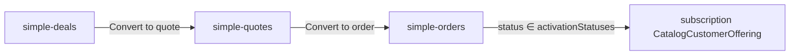

# Simple sales surfaces (orders, quotes, deals, offerings)

## TLDR

**Key Points:**
- Równoległe, mocno uproszczone widoki backendowe z prefiksem ścieżek `simple-*` w modułach **`sales`**, **`customers`**, **`catalog`** — bez nowych encji biznesowych.
- Ścieżka operatora: **simple deal → simple quote → simple order → aktywacja subscription offerings**; pełne UI sales/customers zostaje.
- Osobne ACL + pozycje w sidebarze (grupy Sales / Customers / Catalog).

**Scope:**
- `/backend/sales/simple-orders` (+ create / `[id]`)
- `/backend/sales/simple-quotes` (+ create / `[id]`) — oferty sprzedażowe
- `/backend/customers/simple-deals` (+ create / `[id]`) — proste szanse
- `/backend/catalog/simple-offerings` — lista `CatalogCustomerOffering` (+ linki z karty klienta)
- Settings (sales): **który status zamówienia** uruchamia aktywację **linii subscription**
- CTA: deal → quote, quote → order (1-click, reuse convert)

**Out of scope (v1):**
- Fork danych / nowe tabele dokumentów
- Ukrywanie pełnego UI
- Shipping, returns, invoices, channels, UoM advanced, adjustments w simple UI
- Aktywacja produktów niesubskrypcyjnych z simple order (pozostaje ścieżka pełnego confirm / existing pipeline)

## Decisions (locked)

| # | Decision |
|---|----------|
| 1 | **Both** simple quotes (`SalesQuote`) **and** simple customer offerings (`CatalogCustomerOffering`) |
| 2 | **Coexist** with full UI; **new ACL features**; sidebar entries in the matching module groups |
| 3 | **UI-only** on existing entities/APIs (no new document tables) |
| 4 | **Configurable** order-status value(s) in **sales settings** = “completion → activate subscription lines” |
| 5 | Activate **only subscription product lines** that have start/end dates |
| 6 | **Prices required** (net/gross + currency + tax as needed for existing line validators) |
| 7 | Simple deal = title + customer + pipeline status + links; convertible to quote (lead→deal→order narrative via pipeline + convert CTAs) |
| 8 | Quote → order = **one button**, reuse `sales.quotes.convert_to_order` / `POST /api/sales/quotes/convert` |
| 9 | Deal → quote v1: **quote header only** (no lines); operator adds lines on simple quote |
| 10 | Simple offerings sidebar under **Customers** group (`customers.nav.group`); routes may live in `catalog` module |
| 11 | API `requireFeatures`: **OR** classic feature **or** matching `simple_*` feature |

---

## Overview

Operatorzy klienta potrzebują krótkiej ścieżki sprzedaży subskrypcji/usług bez pełnego edytora dokumentów sales. Simple surfaces to cienkie listy/formularze/detail w bazowych modułach, oparte o te same komendy i tabele.

**Market reference:** HubSpot / Pipedrive “simple deal → quote → order” happy path vs ERP-grade sales docs. Adopt: minimal fields + one-click convert. Reject: separate lightweight document schema (duplicate truth).

Powiązane: `.ai/specs/2026-07-18-customer-guardian-product-case-activation.md`, `SPEC-047` document detail pages.

## Problem Statement

- Pełne `/backend/sales/orders|quotes` są zbyt złożone (kanały, UoM, shipping, multi-price, tabs).
- Brak prostego łańcucha **szansa → oferta → zamówienie** z CTA w jednym miejscu.
- Aktywacja `CatalogCustomerOffering` jest dziś **hardcoded** na status `confirmed` i nie jest konfigurowalna w settings.
- Offerings nie mają samodzielnej listy backend (tylko tab na karcie klienta).

## Proposed Solution

### Surfaces

| Surface | Module | Routes | Entity |
|---------|--------|--------|--------|
| Simple orders | `sales` | `/backend/sales/simple-orders`, `/create`, `/[id]` | `SalesOrder` + lines |
| Simple quotes | `sales` | `/backend/sales/simple-quotes`, `/create`, `/[id]` | `SalesQuote` + lines |
| Simple deals | `customers` | `/backend/customers/simple-deals`, `/create`, `/[id]` | `CustomerDeal` |
| Simple offerings | `catalog` | `/backend/catalog/simple-offerings` (+ optional `/[id]` read); **sidebar: Customers group** | `CatalogCustomerOffering` |

### Shared UX rules (orders & quotes)

**Header fields (required unless noted):**
- Customer (`customerEntityId`)
- Status (dictionary `sales.order_status`)
- Document date (`placedAt` / quote equivalent — map to existing date field used by document)
- Currency
- Lines (at least one)

**Line fields:**
- Product (+ variant if required by catalog rules)
- Quantity
- Unit price + tax (required — Q6)
- If product service line code = `subscription`: **subscription start + end** (required)

**Explicitly hidden in simple UI:** channels, shipping, payments, returns, adjustments, advanced UoM conversion UI, multi-offer price pickers beyond “pick catalog price or enter unit price”.

### Deal (simple)

- Fields: `title`, customer link (person/company), `pipelineId` / stage (or simplified status), optional `expectedCloseAt`, `ownerUserId`
- Detail shows linked simple quote(s) / order(s) when present (via metadata/FK if already exists, or soft link stored in deal `payload` / new optional FKs only if needed — prefer **payload refs** or existing associations first)
- Primary CTA: **Convert to quote** → creates draft `SalesQuote` for same customer, opens simple quote detail (new thin command if none exists today)

### Conversion chain

1. **Deal → Quote:** new command e.g. `customers.deals.convert_to_quote` (or `sales.quotes.create_from_deal`) — creates quote draft, returns `quoteId`, redirects to `/backend/sales/simple-quotes/[id]`.
2. **Quote → Order:** existing `sales.quotes.convert_to_order` via `POST /api/sales/quotes/convert`; redirect to `/backend/sales/simple-orders/[id]`.

### Activation (settings-driven)

Today: `processConfirmedSalesOrderOfferings` treats status **`confirmed`** as trigger.

**Change:**
- Add on `SalesSettings` (json / columns): `subscriptionActivationOrderStatuses: string[]` (status **values**, e.g. `["confirmed","fulfilled"]`), default `["confirmed"]` for BC.
- Sales settings UI section on `/backend/config/sales` (pattern: `OrderEditingSettings` + `GET/PUT /api/sales/settings/...`).
- Subscriber / processor: activate when `order.status` is in configured list.
- **Only** lines where product is subscription service line **and** `subscriptionStartsAt` + `subscriptionEndsAt` are set (Q5). Non-subscription lines: no change to existing non-subscription activation behavior unless already gated by same function — **spec rule:** simple path documents subscription-only activation for the configurable status; keep existing non-subscription activation on the same trigger **only if** current code already does so for confirmed — do not expand scope. Prefer: configurable status replaces hardcoded `confirmed` for the whole `processConfirmedSalesOrderOfferings` entry, and inside keep: subscription lines require dates; non-subscription activate immediately as today.

### ACL (new features)

| Feature | Purpose |
|---------|---------|
| `sales.simple_orders.view` / `sales.simple_orders.manage` | Simple orders pages |
| `sales.simple_quotes.view` / `sales.simple_quotes.manage` | Simple quotes pages |
| `customers.simple_deals.view` / `customers.simple_deals.manage` | Simple deals pages |
| `catalog.simple_offerings.view` / `catalog.simple_offerings.manage` | Simple offerings list (+ activate/deactivate if exposed) |

- Write paths still call existing commands; command layer keeps using `sales.orders.*` / `sales.quotes.*` / etc. where already enforced — **page metadata** uses simple_* features; optionally require **both** simple + base manage for mutate, or map simple.manage → allow calling existing APIs (prefer: simple.manage is enough at page level; API routes unchanged so operators with simple.manage also need base `sales.orders.manage` **or** we widen API metadata to accept simple features).

**API ACL decision (locked for this spec):** extend route `requireFeatures` to accept **either** classic feature **or** corresponding `simple_*` feature (OR), so roles can be granted only simple surfaces without full sales UI features.

### Sidebar

- Simple Orders / Simple Quotes under Sales group (`customers~sales.nav.group`), distinct `pageOrder` near existing orders/quotes.
- Simple Deals under Customers group.
- Simple Offerings under **Customers** group (`pageGroupKey: 'customers.nav.group'`), even if page files live in `catalog`.
- i18n keys: `sales.simpleOrders.nav.title`, etc.

## Architecture

### Components (suggested)

- `packages/core/src/modules/sales/components/simple/` — shared simple document shell, line editor (reuse subscription date fields from `LineItemDialog` patterns, stripped)
- `packages/core/src/modules/customers/components/simple/` — simple deal form
- `packages/core/src/modules/catalog/components/simple/` — offerings table

### Commands & events

| Command | Notes |
|---------|--------|
| Existing order/quote/line CRUD | Reused |
| `sales.quotes.convert_to_order` | Reused for quote→order |
| `customers.deals.convert_to_quote` (new) | Deal→quote |
| Settings GET/PUT for activation statuses | New thin settings API |
| Offering activate/deactivate | Existing |

Events: no new event IDs required if status update still emits `sales.order.updated`.

### Settings data

`SalesSettings` additive field:

| Field | Type | Default |
|-------|------|---------|
| `subscriptionActivationOrderStatuses` | `text[]` / jsonb string array | `["confirmed"]` |

## Data Models

**No new business tables.** Additive only on `SalesSettings`.

Optional (only if deal↔quote link cannot use payload):

| Field | On | Notes |
|-------|-----|--------|
| `sourceDealId` | `SalesQuote.metadata` or nullable column | Prefer metadata first to avoid migration; promote to column if query/filter needed |

Order/quote lines: reuse `subscription_starts_at` / `subscription_ends_at`.

## API Contracts

### Reuse

- `GET/POST/PUT /api/sales/orders`, `/api/sales/order-lines`
- `GET/POST/PUT /api/sales/quotes`, `/api/sales/quote-lines`
- `POST /api/sales/quotes/convert`
- `GET/POST/PUT /api/customers/deals`
- `GET /api/catalog/customer-offerings`, activate/deactivate

### New / extend

- `GET/PUT /api/sales/settings/subscription-activation` — `{ statuses: string[] }`
- `POST /api/customers/deals/convert-to-quote` — `{ dealId }` → `{ quoteId }`
- Order/quote/deal route metadata: feature OR with `simple_*`

### Activation processor

- Replace hardcoded `confirmed` check with settings lookup (cached per request).
- Subscription lines without dates: skip / fail-soft as today; simple UI prevents save without dates.

## User Stories

- **Operator** wants to create a **simple deal** for a customer so the opportunity is tracked without CRM pipeline board complexity.
- **Operator** wants to **convert a deal to a quote** in one click so commercial terms start in simple quotes.
- **Operator** wants to **convert a quote to an order** in one click so fulfillment/activation can proceed.
- **Operator** wants to set **subscription start/end** on order lines so entitlements activate correctly.
- **Admin** wants to configure **which order status activates subscription offerings** in sales settings.
- **Operator** wants a **simple offerings list** to see pending/active entitlements without opening full catalog tooling.

## Phasing

### Phase 1 — Settings + activation config (foundation)

1. Additive `subscriptionActivationOrderStatuses` on `SalesSettings` + migration.
2. Settings API + UI section on `/backend/config/sales`.
3. Wire `processConfirmedSalesOrderOfferings` (or rename internally) to use configured statuses; default `["confirmed"]`.
4. Unit tests for status matching + subscription-date gate.

### Phase 2 — Simple orders & quotes UI

1. ACL features + `page.meta` sidebar entries; `yarn generate`.
2. List/create/detail for simple orders & simple quotes (minimal fields; prices required; subscription dates).
3. Quote detail: primary **Convert to order** → existing convert API → redirect simple order.
4. i18n en/pl.
5. Smoke / integration: create simple quote with line → convert → order has lines + dates.

### Phase 3 — Simple deals + convert to quote

1. ACL + routes for simple deals.
2. Minimal deal CRUD.
3. Command/API convert deal → draft quote (customer copied; **v1: quote header only**, operator adds lines on simple quote).
4. Detail links to resulting simple quote.

### Phase 4 — Simple offerings

1. `/backend/catalog/simple-offerings` DataTable (filter by customer, status, product).
2. Row actions: open customer, open source order (if FK), activate/deactivate when allowed.
3. Keep existing customer detail tab; link “Open simple offerings” optional.

### Phase 5 — Polish & docs

1. Flash/errors, empty states, feature defaults in `setup.ts` `defaultRoleFeatures` (optional for admin role).
2. Spec changelog + short skill note if procedure/sales authoring mentions simple paths.
3. Integration coverage per new API paths listed in this spec.

## Implementation Plan (step checklist)

See Phases 1–5. Each phase ends with app runnable and tests for that slice.

## Risks & Impact Review

| Scenario | Severity | Area | Mitigation | Residual |
|----------|----------|------|------------|----------|
| Roles with only `simple_*` blocked by API still requiring `sales.orders.manage` | High | ACL | OR-extend API metadata for simple features | Misconfigured roles |
| Activation status misconfigured → no offerings / too early | High | Catalog activation | Default `confirmed`; settings UI shows dictionary labels; audit log on settings change | Operator error |
| Dual UI edits same order inconsistently | Medium | Sales | Simple edits subset; full editor remains | Training |
| Deal→quote without product lines | Low | UX | Documented; CTA to add lines on simple quote | — |
| BC: renaming processor / status check | Medium | Catalog subscribers | Bridge: empty settings ⇒ treat as `["confirmed"]` | — |

## Migration & Backward Compatibility

- Additive `SalesSettings` field only; default preserves current `confirmed` behavior.
- No removal of full sales/customers routes.
- New ACL IDs (frozen once shipped); do not rename.
- Quote convert API unchanged.
- Optional metadata `sourceDealId` on quotes — additive.

## Integration coverage (required)

| Path | Coverage |
|------|----------|
| `PUT /api/sales/settings/subscription-activation` | Unit + API |
| Order status → activation for subscription line with dates | Unit / integration |
| `POST /api/sales/quotes/convert` from simple quote flow | Integration |
| `POST /api/customers/deals/convert-to-quote` | Integration |
| Simple order/quote create with required price + subscription dates | Integration |
| Simple offerings list GET | Integration |

## Final Compliance Report

| Check | Status |
|-------|--------|
| Singular event/command naming | Pass (planned) |
| No cross-module ORM relations | Pass (UUID FKs) |
| Additive schema | Pass |
| Undo for settings/convert | Follow existing convert undo if present; settings = last-write |
| Spec lists integration paths | Pass |
| Open Questions gate | Closed (2026-07-20 answers) |

## Changelog

| Date | Note |
|------|------|
| 2026-07-20 | Skeleton + Open Questions |
| 2026-07-20 | Locked decisions Q1–Q8; full architecture, phases, ACL, settings-driven activation, BC |
| 2026-07-20 | Follow-ups: deal→quote header-only; offerings nav under Customers; API feature OR |
| 2026-07-20 | Phase 1: `subscriptionActivationOrderStatuses` on SalesSettings + API/UI + processor wiring |
| 2026-07-20 | Phases 2–5: simple orders/quotes/deals/offerings UI, ACL OR on APIs, deal→quote convert, offerings list |
| 2026-07-20 | Backend UI conventions: DataTable hubs (RBAC, perspective, ConfirmDialog), CrudForm + EntitySearchCombobox document editor, DealForm shell (no double header) |
| 2026-07-20 | Product detail CTAs → simple quote/order create with `?productId=` line prefill |
