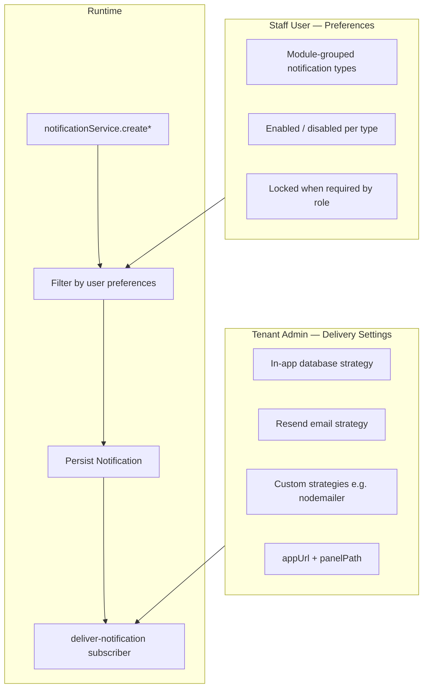

# Notification Delivery & Preferences Settings

## TLDR

**Key Points:**
- **Tenant admin** configures how notifications are **delivered** (in-app, Resend email, custom strategies) at **Settings → Module Configs → Notification Delivery** (`/backend/config/notifications`).
- **End users** configure which **notification types** they want to receive at **Profile → Notification Preferences** (`/backend/profile/notifications`).
- Delivery settings persist in module config key `notifications.delivery_strategies`; user preferences in `user_notification_preferences` table.
- The notification service filters recipients based on user preferences before creating in-app notifications; email delivery only runs for notifications that were actually created.

**Scope:**
- Admin delivery settings API + UI (core + custom strategies)
- User preference API + UI (module-grouped checkboxes, role-locked options)
- Integration with inject notifications (`insurance_desk`, `lead_intake`)
- Profile navigation (sidebar + dropdown)

**Concerns:**
- Two email channels (Resend + Nodemailer) require operator discipline.
- User preferences do not retroactively delete already-created notifications.

---

## Overview

The notifications module (SPEC-003) provides in-app notifications and optional external delivery. This spec covers **two complementary settings surfaces** implemented for RS Moto Concierge CRM:

| Surface | Audience | Purpose |
|---------|----------|---------|
| **Delivery settings** | Tenant admin (`notifications.manage`) | Channel config: in-app, Resend, custom strategies, app URL |
| **Notification preferences** | Authenticated staff user | Opt-in/opt-out per notification type, scoped by ACL |

> **Market Reference**: GitHub and Slack separate **workspace/organization delivery config** from **per-user notification preferences**. We follow the same split: admin owns channels; users own subscription matrix within their permission scope.

## Problem Statement

1. **No admin UI for delivery strategies**: Env vars alone insufficient for multi-tenant operators.
2. **Custom strategies without descriptors**: Extensions could register handlers but admin could not discover or toggle them.
3. **No per-user opt-out**: All users with a feature received every `createForFeature` notification.
4. **Inject notifications need role semantics**: When role grants `*.inject.notify`, notification must be mandatory; otherwise user controls preference.
5. **Profile UX gap**: SPEC-007 planned profile notification section; only change-password existed.

## Proposed Solution

### Two-tier model



---

## Part A — Tenant Delivery Settings

### Architecture

| Component | Path |
|-----------|------|
| Settings page | `packages/core/src/modules/notifications/backend/config/notifications/page.tsx` |
| Client UI | `packages/core/src/modules/notifications/frontend/NotificationSettingsPageClient.tsx` |
| Config resolver | `packages/core/src/modules/notifications/lib/deliveryConfig.ts` |
| Strategy registry | `packages/core/src/modules/notifications/lib/deliveryStrategies.ts` |
| Settings registry (UI) | `packages/core/src/modules/notifications/frontend/deliveryStrategySettingsRegistry.tsx` |
| Delivery subscriber | `packages/core/src/modules/notifications/subscribers/deliver-notification.ts` |
| API | `packages/core/src/modules/notifications/api/settings/route.ts` |

### UI sections

1. **Core delivery**
   - Application URL (`appUrl`)
   - Notification panel path (`panelPath`, default `/backend/notifications`)
   - In-app notifications toggle (always on, disabled switch — database strategy is mandatory)

2. **Email strategy (Resend)**
   - Enable toggle
   - From, reply-to, subject prefix

3. **Custom delivery strategies** (when registered)
   - One card per strategy from `listNotificationDeliveryStrategyDescriptors()`
   - Enable toggle with env-default hint
   - Optional settings component from `getNotificationDeliveryStrategySettingsComponent(id)`
   - Example: Nodemailer — see `2026-06-14-nodemailer-notification-delivery-strategy.md`

### Data model — module config

| Field | Type | Notes |
|-------|------|-------|
| Module | `notifications` | |
| Key | `delivery_strategies` | `NOTIFICATIONS_DELIVERY_CONFIG_KEY` |
| Scope | Tenant-wide | via `moduleConfigService` |

```typescript
type NotificationDeliveryConfig = {
  appUrl?: string
  panelPath: string
  strategies: {
    database: { enabled: boolean }          // always true in practice
    email: {
      enabled: boolean
      from?: string
      replyTo?: string
      subjectPrefix?: string
    }
    custom?: Record<string, {
      enabled?: boolean
      config?: unknown
    }>
  }
}
```

Env defaults applied when DB config absent (`DEFAULT_NOTIFICATION_DELIVERY_CONFIG`):

| Env | Maps to |
|-----|---------|
| `APP_URL` / `APPLICATION_URL` / `NEXT_PUBLIC_APP_URL` | `appUrl` |
| `NOTIFICATIONS_PANEL_PATH` | `panelPath` |
| `NOTIFICATIONS_EMAIL_ENABLED` | `strategies.email.enabled` |
| `NOTIFICATIONS_EMAIL_FROM`, etc. | email fields |

### API contracts — delivery settings

#### `GET /api/notifications/settings`

- **Auth**: `requireAuth` + `notifications.manage`
- **Response**:

```json
{
  "settings": { /* NotificationDeliveryConfig */ },
  "customStrategies": [
    { "id": "nodemailer", "label": "Email (Nodemailer)", "defaultEnabled": false }
  ]
}
```

#### `POST /api/notifications/settings`

- **Auth**: same as GET
- **Body**: `notificationDeliveryConfigSchema` (zod)
- **Response**: `{ ok: true, settings, customStrategies }`
- **Errors**: `400` invalid payload, `401` unauthorized, `500` config service failure

### Delivery runtime

On `notifications.notification.created`:

1. Load `deliveryConfig`
2. If `strategies.email.enabled` && recipient has email && `panelLink` → send via Resend (`sendEmail` + `NotificationEmail`)
3. For each registered custom strategy:
   - `enabled = strategyConfig.enabled ?? strategy.defaultEnabled ?? false`
   - If enabled → `strategy.deliver(ctx)`

**panelLink** requires `appUrl` + `panelPath`. Without `appUrl`, email strategies skip sending (debug log).

### Extending with a custom strategy

1. Register handler: `registerNotificationDeliveryStrategy({ id, label, defaultEnabled, deliver })`
2. Register UI (client): `registerNotificationDeliveryStrategySettings(id, Component)`
3. Import client registration in app `ClientBootstrap`
4. Strategy appears automatically in GET settings `customStrategies`

---

## Part B — User Notification Preferences

### Architecture

| Component | Path |
|-----------|------|
| Profile page | `packages/core/src/modules/notifications/backend/profile/notifications/page.tsx` |
| Editor UI | `packages/core/src/modules/notifications/components/NotificationPreferencesEditor.tsx` |
| Preference service | `packages/core/src/modules/notifications/lib/notificationPreferenceService.ts` |
| Type catalog | `packages/core/src/modules/notifications/lib/notificationPreferenceCatalog.ts` |
| Definitions merge | `packages/core/src/modules/notifications/lib/notificationPreferenceDefinitions.ts` |
| Type registry | `packages/core/src/modules/notifications/lib/notification-types-registry.ts` |
| API | `packages/core/src/modules/notifications/api/preferences/route.ts` |
| Profile nav | `packages/core/src/modules/auth/lib/profile-sections.tsx` |

Bootstrap: `apps/mercato/src/bootstrap.ts` registers all notification types from generated registry.

### Data model — `user_notification_preferences`

| Column | Type | Notes |
|--------|------|-------|
| `id` | uuid PK | |
| `user_id` | uuid | FK → users |
| `tenant_id` | uuid | tenant scope |
| `notification_type` | text | e.g. `insurance_desk.lead.injected` |
| `enabled` | boolean | default `true` |
| `created_at` | timestamptz | |
| `updated_at` | timestamptz | nullable |

**Unique**: `(user_id, tenant_id, notification_type)`

Migration: `packages/core/src/modules/notifications/migrations/Migration20260701084846.ts`

### Notification type preference metadata

Extended `NotificationTypeDefinition` (shared types):

```typescript
userPreference?: {
  labelKey: string
  scopeFeature: string           // min ACL to see/configure
  lockFeature?: string           // role grant → locked on
  lockedWhenRoleGrants?: boolean
  defaultEnabled?: boolean       // default true
}
```

Catalog sources (merged):

1. `userPreference` on type definition (app modules, e.g. inject types)
2. `CORE_NOTIFICATION_PREFERENCE_DEFINITIONS` in `notificationPreferenceCatalog.ts`

**Not configurable** (no preference entry): system notifications (`auth.password_reset.*`, etc.) — always delivered when targeted.

### Preference resolution logic

For each `(userId, tenantId, notificationType)`:

1. If type not in catalog → **deliver** (backward compatible)
2. If `lockFeature` granted via **role ACL only** and `lockedWhenRoleGrants` → **deliver**, UI shows locked checked
3. Else if stored preference row exists → use `enabled`
4. Else → `defaultEnabled ?? true`

**Role vs effective ACL**: Lock detection uses role ACLs only (`getRoleGrantedFeaturesForUser`), not per-user ACL overrides — so admin-granted user ACL does not lock preference.

### Recipient resolution for inject types

`createForNotificationType()` (used by inject routes):

1. Collect candidates: users with `scopeFeature` + users with `lockFeature` + users with explicit `enabled=true` preference row
2. Filter each through `shouldDeliverNotification`

Inject features:

| Type | scopeFeature | lockFeature |
|------|--------------|-------------|
| `insurance_desk.lead.injected` | `insurance_desk.access` | `insurance_desk.leads.inject.notify` |
| `lead_intake.deal.injected` | `lead_intake.submit` | `lead_intake.deals.inject.notify` |

### API contracts — user preferences

#### `GET /api/notifications/preferences`

- **Auth**: `requireAuth` (any authenticated user)
- **Response**:

```json
{
  "groups": [
    {
      "moduleId": "insurance_desk",
      "moduleTitle": "Insurance desk",
      "types": [
        {
          "type": "insurance_desk.lead.injected",
          "labelKey": "insurance_desk.notifications.preferences.lead_injected",
          "enabled": true,
          "locked": true
        }
      ]
    }
  ]
}
```

Groups include only modules/types visible to user's effective ACL (`userHasScopeForPreference`).

#### `PUT /api/notifications/preferences`

- **Auth**: `requireAuth`
- **Body**: `{ preferences: Record<notificationType, boolean> }`
- **Validation**: Only types user may see; locked types ignored on save
- **Response**: `{ ok: true }`

### UI — NotificationPreferencesEditor

- Module cards in 2-column grid (ACL-editor pattern)
- Module header: **„Wszystkie”** checkbox (toggles all non-locked types in module)
- Per-type checkbox; locked types disabled with „Required by role” hint
- Save → `PUT /api/notifications/preferences`

### UI — Profile navigation

**Sidebar** (`profile-sections.tsx`):

| Group | Item | Path |
|-------|------|------|
| Account | Change Password | `/backend/profile/change-password` |
| Notifications | Notification Preferences | `/backend/profile/notifications` |

**Profile dropdown** (`ProfileDropdown.tsx`):

1. Profile → `/backend/profile`
2. Change Password
3. Notification Preferences → `/backend/profile/notifications` (when `notificationsHref` set)

Wired in `apps/mercato/src/app/(backend)/backend/layout.tsx`.

### Service integration

Filtered paths in `notificationService`:

| Method | Filtering |
|--------|-----------|
| `create` | `shouldDeliverNotification` for single recipient |
| `createBatch` | `filterRecipientsByNotificationPreferences` |
| `createForRole` | filter |
| `createForFeature` | filter |
| `createForNotificationType` | `resolveRecipientsForNotificationType` |

Worker `notifications:create` applies same filters for async jobs.

### Configurable notification types (catalog)

| Module | Types |
|--------|-------|
| `customers` | `customers.deal.won`, `customers.deal.lost` |
| `sales` | `sales.order.created`, `sales.quote.created`, `sales.payment.received`, `sales.quote.expiring` |
| `staff` | `staff.leave_request.pending`, `.approved`, `.rejected` |
| `inbox_ops` | `inbox_ops.proposal.created` |
| `catalog` | `catalog.product.low_stock` |
| `business_rules` | `business_rules.rule.execution_failed` |
| `webhooks` | `webhooks.delivery.failed` |
| `checkout` | `checkout.transaction.completed`, `.failed`, `checkout.link.usageLimitReached` |
| `workflows` | `workflows.task.assigned` |
| `procurement` | `procurement.process_task.assigned` |
| `messages` | `messages.new` |
| `customer_accounts` | `customer_accounts.user.signup`, `.user.locked` |
| `security` (enterprise) | password/MFA notifications |
| `record_locks` (enterprise) | collaboration lock notifications |
| `insurance_desk` (app) | `insurance_desk.lead.injected` |
| `lead_intake` (app) | `lead_intake.deal.injected` |

Visibility per user depends on enabled modules and ACL features.

## Internationalization (i18n)

### Delivery settings

`packages/core/src/modules/notifications/i18n/*` — keys under `notifications.settings.*`

### User preferences

- `notifications.preferences.*` — UI chrome
- Per-type `labelKey` in catalog / module `notifications.ts`
- App inject labels: `insurance_desk.notifications.preferences.lead_injected`, `lead_intake.notifications.preferences.deal_injected` in `apps/mercato/src/i18n/{en,pl}.json`

### Profile

- `profile.sections.notifications`
- `settings.profile.notifications`
- `ui.profileMenu.profile`, `ui.profileMenu.notifications`

## ACL

| Feature | Used for |
|---------|----------|
| `notifications.manage` | Admin delivery settings API + page |
| `notifications.view` | View own in-app notifications (unchanged) |
| Per-module features | Preference visibility + scope |
| `*.inject.notify` | Mandatory inject notifications when granted by role |

## Migration & Backward Compatibility

- **Additive**: New table `user_notification_preferences`; new API routes; new profile page.
- **Default behavior**: Types without catalog entry → always delivered (unchanged).
- **Types with catalog**: Default enabled until user opts out.
- **Module config key** `delivery_strategies` unchanged from SPEC-003; `custom` map extended by providers.
- **Contract surface**: New API paths stable; preference filtering is behavioral enhancement for catalogued types only.

## Implementation Summary

### Phase 1 — Admin delivery settings UI ✅

- Extended `NotificationSettingsPageClient` with custom strategy cards + settings registry
- API returns `customStrategies` descriptors

### Phase 2 — User preferences ✅

- Entity + migration
- Preference service + catalog
- API `GET/PUT /api/notifications/preferences`
- `NotificationPreferencesEditor` + profile page
- `notificationService` filtering + `createForNotificationType`
- Inject routes use `createForNotificationType`

### Phase 3 — Profile UX ✅

- `profile-sections.tsx` notifications group
- `ProfileDropdown` profile + notifications links
- Profile hub page at `/backend/profile`

### Testing Strategy

| Test | Status |
|------|--------|
| `notificationService.test.ts` | Existing — passes with filtering |
| Nodemailer delivery unit tests | See nodemailer spec |
| Integration `TC-NOTIF-*` | Recommended: preferences API + delivery settings save/load |
| Manual | Admin toggles Nodemailer; user opts out of deal.won; verify no notification created |

## Risks & Impact Review

#### User opts out but role mandates inject notify
- **Scenario**: Role has `insurance_desk.leads.inject.notify` but user tries to disable
- **Severity**: Low
- **Mitigation**: UI locked; save API ignores locked types; delivery always includes role-locked users
- **Residual risk**: None for locked path

#### Preference filter + createForFeature mismatch
- **Scenario**: User without feature but enabled preference expects inject email
- **Severity**: Low
- **Mitigation**: `createForNotificationType` includes preference-enabled users with module scope
- **Residual risk**: User must have module access feature to see toggle

#### Dual email channels
- **Scenario**: Resend and Nodemailer both enabled
- **Severity**: Medium
- **Mitigation**: Documented in env.example and nodemailer spec
- **Residual risk**: Operator configuration

#### Missing appUrl blocks all email
- **Severity**: Medium
- **Mitigation**: Admin settings field + debug logs
- **Residual risk**: Silent skip without monitoring

#### Catalog maintenance
- **Scenario**: New `notifications.ts` type without catalog entry → not user-configurable
- **Severity**: Low
- **Mitigation**: Add to `notificationPreferenceCatalog.ts` or `userPreference` on type def
- **Residual risk**: Developer discipline

## Final Compliance Report — 2026-06-14

### AGENTS.md Files Reviewed

- `AGENTS.md` (root)
- `packages/core/AGENTS.md` → Notifications
- `.cursor/rules/module-backend-ui.mdc` (profile pages)
- `BACKWARD_COMPATIBILITY.md` — API + schema additive rules

### Compliance Matrix

| Rule Source | Rule | Status | Notes |
|-------------|------|--------|-------|
| root AGENTS.md | Tenant scoping | Compliant | `tenant_id` on preferences |
| root AGENTS.md | Zod validation | Compliant | settings + preferences schemas |
| root AGENTS.md | i18n for user strings | Compliant | |
| root AGENTS.md | `apiCall` in backend UI | Compliant | |
| SPEC-003 | Delivery strategies extension | Compliant | |
| BC #7 API routes | Additive response fields | Compliant | `customStrategies` on GET |

### Verdict

**Fully compliant** — implemented.

## Related Specs

- [SPEC-003 — Notifications Module](./SPEC-003-2026-01-23-notifications-module.md) — foundation
- [2026-06-14 — Nodemailer Notification Delivery Strategy](./2026-06-14-nodemailer-notification-delivery-strategy.md) — custom email channel
- [SPEC-007 — Sidebar Reorganization](./SPEC-007-2026-01-26-sidebar-reorganization.md) — profile sections plan

## Changelog

### 2026-06-14
- Initial specification documenting tenant delivery settings, custom strategy admin UI, and user notification preferences (profile panel + service filtering).
