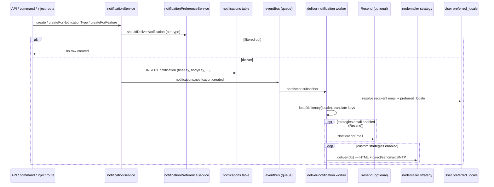

# Notification Lifecycle — Creation to Email Delivery (RS Moto / self-hosted)

## TLDR

**Key Points:**
- End-to-end flow: **type definition → service create (with preference filter) → DB row → event → `deliver-notification` worker → in-app + email channels**.
- RS Moto Concierge CRM uses **`mail_delivery`** (Nodemailer, transport `direct`) instead of Resend; Resend channel disabled via `NOTIFICATIONS_EMAIL_ENABLED=false`.
- Outbound email copy uses the **recipient user's `preferred_locale`**; fallback **`pl`** (`emailDefaultLocale`), not UI `defaultLocale` (`en`).
- Locale is persisted on **`users.preferred_locale`** when the user changes language (`POST/GET /api/auth/locale` while authenticated).
- All staff-facing email templates (notification shell, messages, procedure notify, password reset, sales quotes) resolve translations for the chosen locale.

**Scope:**
- Creation API / service / workers / preference filtering
- `notifications.notification.created` → delivery subscriber
- Nodemailer strategy + worker bootstrap
- Recipient locale resolution + translation catalogs
- Production configuration (RS Moto)

**Related specs:**
- [SPEC-003 — Notifications Module](./SPEC-003-2026-01-23-notifications-module.md) — foundation
- [2026-06-14 — Notification Delivery & Preferences Settings](./2026-06-14-notification-delivery-settings.md) — admin + user settings
- [2026-06-14 — Nodemailer Notification Delivery Strategy](./2026-06-14-nodemailer-notification-delivery-strategy.md) — `mail_delivery` module

---

## Overview

This document describes the **implemented** notification pipeline in Open Mercato as deployed for **RS Moto Concierge CRM** (`apps/mercato`): from declaring a notification type through optional user opt-out, persistence, asynchronous delivery, and localized HTML email.

It consolidates behavior introduced across SPEC-003, delivery settings, Nodemailer strategy, and subsequent production fixes (worker registration, direct SMTP, recipient locale).

## Problem Statement

1. **Self-hosted email**: SaaS Resend is unsuitable; operators need Postfix/direct MX or corporate SMTP without forking core.
2. **Worker gap**: Custom delivery strategies registered only in the Next.js process were **missing in queue workers** — emails never sent despite in-app notifications working.
3. **Wrong email language**: Delivery used hardcoded `defaultLocale` (`en`); UI locale lived only in cookies, unavailable in workers.
4. **Polish-first CRM**: RS Moto operators and staff expect **Polish by default** when user language is unknown.
5. **Incomplete translations**: App-module notification keys (`lead_intake`, `insurance_desk`) and some email shells lacked `es`/`de` coverage.

## End-to-End Architecture



### Phase 1 — Declaration & creation

| Step | Component | Notes |
|------|-----------|-------|
| 1 | Module `notifications.ts` | `type`, `titleKey`, `bodyKey`, optional `userPreference`, actions |
| 2 | `buildNotificationFromType()` | Maps type def → `CreateNotificationInput` with variables |
| 3 | `notificationService.create*` | Single, batch, role, feature, **`createForNotificationType`** |
| 4 | Preference filter | Catalogued types → `shouldDeliverNotification`; inject types use role lock + scope (see delivery settings spec) |
| 5 | Persist | `notifications` entity; i18n keys stored, not rendered text |
| 6 | Emit | `NOTIFICATION_EVENTS.CREATED` with `notificationId`, `recipientUserId`, tenant/org scope |

**Inject examples (app modules):**

| Type | Route | lock feature |
|------|-------|--------------|
| `insurance_desk.lead.injected` | `POST …/insurance/leads/inject` | `insurance_desk.leads.inject.notify` |
| `lead_intake.deal.injected` | `POST …/deals/inject` | `lead_intake.deals.inject.notify` |

### Phase 2 — In-app display

- Panel polls `/api/notifications`; client resolves `titleKey` / `bodyKey` via **session UI locale** (cookie / `detectLocale`).
- Independent from email locale (email uses DB `preferred_locale`).

### Phase 3 — Email delivery subscriber

**File:** `packages/core/src/modules/notifications/subscribers/deliver-notification.ts`

| Step | Behavior |
|------|----------|
| Load config | `resolveNotificationDeliveryConfig` (DB → env defaults) |
| Load notification | By `notificationId` + tenant |
| Resolve recipient | `findOneWithDecryption(User)` → email, name, **`locale`** via `resolveLocaleForEmail(preferredLocale)` |
| Resolve copy | `loadDictionary(locale)` + `createFallbackTranslator`; interpolate `titleKey`/`bodyKey` and action `labelKey` |
| Resend channel | If `strategies.email.enabled` && email && `panelLink` → `sendEmail(NotificationEmail)` |
| Custom strategies | Each enabled strategy → `strategy.deliver(ctx)` with shared `t` translator |

**Preconditions for any email send:**

- Recipient has decrypted email
- `panelLink` built from `appUrl` + `panelPath` (requires `APP_URL`)
- Global kill switches: `OM_DISABLE_EMAIL_DELIVERY`, `OM_TEST_MODE`

### Phase 4 — Nodemailer strategy (`mail_delivery`)

**Module:** `apps/mercato/src/modules/mail_delivery/`

| Concern | Implementation |
|---------|----------------|
| Registration (HTTP) | `di.ts` → `registerNodemailerNotificationDeliveryStrategy()` |
| Registration (worker) | `generators.ts` → `mail-delivery-bootstrap.generated.ts` → `runBootstrapRegistrations()` in worker/CLI |
| Early HTTP bootstrap | `apps/mercato/src/bootstrap.ts` — global registry before DI |
| Notification deliver | `nodemailerNotificationDelivery.ts` — reuses `NotificationEmail`, plain-text fallback |
| Transactional deliver | `nodemailerTransactionalEmail.ts` — `sendTransactionalEmail` hook for messages module |
| Transport router | `nodemailerSendMail.ts` |
| **Direct MX** | `nodemailerDirectSmtp.ts` — DNS MX lookup, port 25 (Strapi `@strapi/provider-email-sendmail` semantics; **not** local Postfix pipe) |
| Local sendmail pipe | `transport: sendmail` — `{ sendmail: true }` or custom path |

**Worker bootstrap fix:** `packages/shared/src/lib/bootstrap/dynamicLoader.ts` invokes `runBootstrapRegistrations()` so strategies exist in `mercato worker` / `AUTO_SPAWN_WORKERS` processes.

### Phase 5 — Recipient locale & translations

#### Data model

| Table / field | Type | Purpose |
|---------------|------|---------|
| `users.preferred_locale` | `text` nullable | Persisted UI/email language (`en` \| `pl` \| `es` \| `de`) |

Migration: `packages/core/src/modules/auth/migrations/Migration20260702065021.ts`

#### Resolution API

| Helper | Location | Rule |
|--------|----------|------|
| `emailDefaultLocale` | `packages/shared/src/lib/i18n/config.ts` | **`pl`** when user locale unknown |
| `normalizeUserLocale` | `packages/core/src/modules/auth/lib/userLocale.ts` | Validates against `locales` |
| `resolveLocaleForEmail` | same | `preferred_locale` → else `emailDefaultLocale` |
| `resolveUserLocale` | same | Load by `userId` (+ tenant/org scope) |
| `resolveUserLocaleByEmail` | same | Lookup by email / `emailHash` (encrypted tenants) |
| `resolveTranslationsForLocale` | `packages/shared/src/lib/i18n/server.ts` | Dictionary + `translate` without request cookies |

#### Persist on language change

**File:** `packages/core/src/modules/auth/api/locale/route.ts`

- `POST` / `GET` set cookie **and**, when `getAuthFromRequest` has `sub`, update `users.preferred_locale`.

#### Email surfaces using recipient locale

| Surface | Locale source |
|---------|----------------|
| Notification email (`deliver-notification`) | Recipient `preferred_locale` |
| Message email to staff (`email-sender`) | `resolveUserLocale(recipientUserId)` |
| Procedure notify to staff | same |
| Procedure notify / message to **external** email | `emailDefaultLocale` (`pl`) |
| Password reset email | User row from `requestPasswordReset` |
| Quote sent to customer | `emailDefaultLocale` (external) |
| Quote accepted admin email | `resolveUserLocaleByEmail(ADMIN_EMAIL)` |

## Data Models (summary)

| Entity / config | Role in pipeline |
|-----------------|------------------|
| `notifications` | In-app record + i18n keys |
| `user_notification_preferences` | Per-user opt-out matrix |
| `notifications.delivery_strategies` (module config) | Channels: database, Resend, custom |
| `users.preferred_locale` | Email translation locale |

## API Contracts (touchpoints)

| Endpoint / event | Role |
|------------------|------|
| `POST /api/notifications/*` | Create paths (internal) |
| `GET/PUT /api/notifications/preferences` | User opt-out |
| `GET/POST /api/notifications/settings` | Admin delivery config |
| `POST /api/auth/locale` | Persist `preferred_locale` |
| `notifications.notification.created` | Triggers delivery worker |

## Email templates & i18n keys

### Notification email shell

`packages/core/src/modules/notifications/emails/NotificationEmail.tsx`

Keys: `notifications.delivery.email.*` — **pl, en, es, de** in `packages/core/src/modules/notifications/i18n/`.

### Module notification content keys

Resolved at delivery time from merged dictionary (`loadDictionary`):

| Module | Key prefix | Locales (RS Moto app) |
|--------|------------|------------------------|
| Core modules | `{module}.notifications.*` | pl, en, es, de per module |
| `lead_intake` | `lead_intake.notifications.*` | pl, en, **es, de** (`apps/mercato/src/i18n/`) |
| `insurance_desk` | `insurance_desk.notifications.*` | pl, en, **es, de** |

### Transactional templates (non-notification-event)

| Template | i18n prefix | Locales |
|----------|-------------|---------|
| `MessageEmail` | `messages.email.*` | pl, en, es, de |
| `ProcedureNotifyOwnerEmail` / `Customer` | `cases.email.procedureNotify.*` | pl, en, **es, de** (new `cases/i18n/es.json`, `de.json`) |
| `ResetPasswordEmail` | `auth.email.resetPassword.*` | pl, en, es, de |
| `QuoteSentEmail` / `QuoteAcceptedAdminEmail` | `sales.quotes.email.*`, `sales.quotes.accept.adminEmail.*` | pl, en, es, de |

## Production configuration (RS Moto Concierge)

Verified on `https://crm.rsmotoconcierge.pl`:

```bash
APP_URL=https://crm.rsmotoconcierge.pl
ADMIN_EMAIL=hello@sziarko.pl
NOTIFICATIONS_EMAIL_FROM=biuro@rsmotoconcierge.pl
NOTIFICATIONS_EMAIL_ENABLED=false          # disable Resend duplicate
NODEMAILER_TRANSPORT=direct                # MX delivery (port 25)
NOTIFICATIONS_NODEMAILER_ENABLED=true      # or enabled in tenant settings UI
AUTO_SPAWN_WORKERS=true
```

**Operator notes:**

- Do **not** rely on `sendmail` transport when local Postfix is loopback-only (`inet_interfaces = loopback-only`) — use **`direct`**.
- Enable only one primary HTML email channel (Nodemailer **or** Resend) to avoid duplicates.
- Run `yarn db:migrate` after deploy to add `users.preferred_locale`.
- Staff must switch language once in UI (or set DB field) for non-Polish emails.

## Migration & Backward Compatibility

| Change | Classification | Notes |
|--------|----------------|-------|
| `users.preferred_locale` | Schema additive | Nullable; no breaking API |
| `emailDefaultLocale = pl` | Behavioral | Only affects email when locale unset; UI default remains `en` |
| `direct` transport kind | Additive | New enum value in Nodemailer settings |
| `sendTransactionalEmail` on strategy | Additive | Optional strategy method |
| `resolveTranslationsForLocale` | Additive export | Shared i18n helper |
| Worker bootstrap registrations | Behavioral fix | Required for custom strategies in workers |

## Testing Strategy

| Layer | Coverage |
|-------|----------|
| Unit | `deliver-notification.test.ts`, `nodemailerNotificationDelivery.test.ts`, `transactionalEmailDelivery.test.ts` |
| Manual | Trigger inject notification → in-app + email; change user locale → verify Polish/English subject |
| Integration (recommended) | `TC-NOTIF-*` with `NODEMAILER_TRANSPORT=json`; preferences opt-out before create |

## Risks & Impact Review

#### Email language mismatch vs UI
- **Scenario**: User uses English UI but never saved locale → emails in Polish
- **Severity**: Low
- **Mitigation**: `emailDefaultLocale` matches RS Moto business default; locale API persists on switch
- **Residual risk**: Until first locale change, emails stay Polish

#### Worker without bootstrap
- **Scenario**: Strategy not registered in worker → silent no email
- **Severity**: High
- **Mitigation**: `mail_delivery` generator plugin + `runBootstrapRegistrations`
- **Residual risk**: New app modules must register bootstrap plugins

#### Direct transport blocked by host
- **Scenario**: VPS blocks outbound port 25
- **Severity**: High
- **Mitigation**: Fall back to `smtp` with relay; monitor Nodemailer errors
- **Residual risk**: Infrastructure-dependent

#### Duplicate Resend + Nodemailer
- **Severity**: Medium
- **Mitigation**: `NOTIFICATIONS_EMAIL_ENABLED=false` in production
- **Residual risk**: Misconfiguration

## Final Compliance Report — 2026-06-14

| Rule | Status |
|------|--------|
| Provider in app module (`mail_delivery`) | Compliant |
| Additive schema / API | Compliant |
| i18n — no hardcoded email copy in delivery paths | Compliant |
| Tenant scoping on notifications + preferences | Compliant |
| BC contract surfaces (event IDs, strategy id `nodemailer`) | Compliant |

**Verdict:** Implemented and deployed on RS Moto Concierge CRM.

## Changelog

### 2026-06-14
- Initial end-to-end lifecycle spec: creation → preferences → delivery → localized email.
- Documents Nodemailer `direct` transport, worker bootstrap, `preferred_locale`, `emailDefaultLocale=pl`, and translation coverage for RS Moto app modules.
